# ARCHITECTURE — 부산 하천 탐험대

> 이 문서는 "무엇을 만들었는가"보다 **"왜 그렇게 만들었고 무엇을 포기했는가"**를 남기기 위한 것입니다.
> 심사위원과, 이 코드를 이어받을 개발자가 대상입니다.
>
> 검증 기준: `git log` 7커밋, `supabase/migrations/0001~0016`, 실 DB 조회(Supabase MCP), `npx vitest run` 실측.
> 확인하지 못한 것은 **"모른다"**고 적었습니다. §10에 몰아 두었습니다.

**한 줄 요약** — 부산 5대 하천(수영강·부전천·온천천·동천·대천천)을 걸으며 체험 미션과 퀴즈를 완수하고
배지를 모으는 교육용 PWA. 프론트는 React + Vite, 백엔드는 Supabase(Postgres + PostGIS + RLS) 하나입니다.

---

## 목차

1. [시스템 개요](#1-시스템-개요)
2. [기술 선택과 그 이유](#2-기술-선택과-그-이유)
3. [데이터 모델](#3-데이터-모델)
4. [콘텐츠를 DB가 정의하는 구조](#4-콘텐츠를-db가-정의하는-구조)
5. [진행 상황과 완수 판정 — "없는 단계는 통과"](#5-진행-상황과-완수-판정--없는-단계는-통과)
6. [위치 처리](#6-위치-처리)
7. [이미지 파이프라인](#7-이미지-파이프라인)
8. [프론트엔드 구조](#8-프론트엔드-구조)
9. [테스트 전략](#9-테스트-전략)
10. [알려진 한계](#10-알려진-한계-숨기지-않은-목록)

---

## 1. 시스템 개요

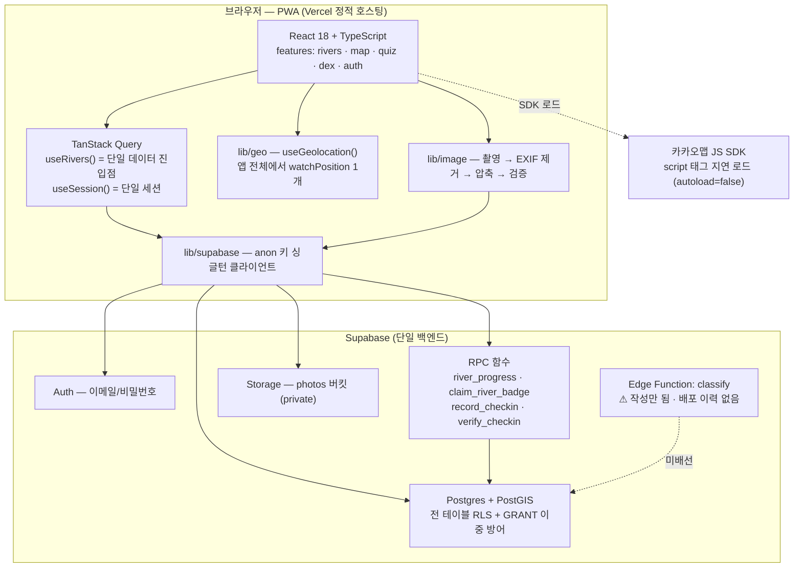

**핵심 흐름 한 번**

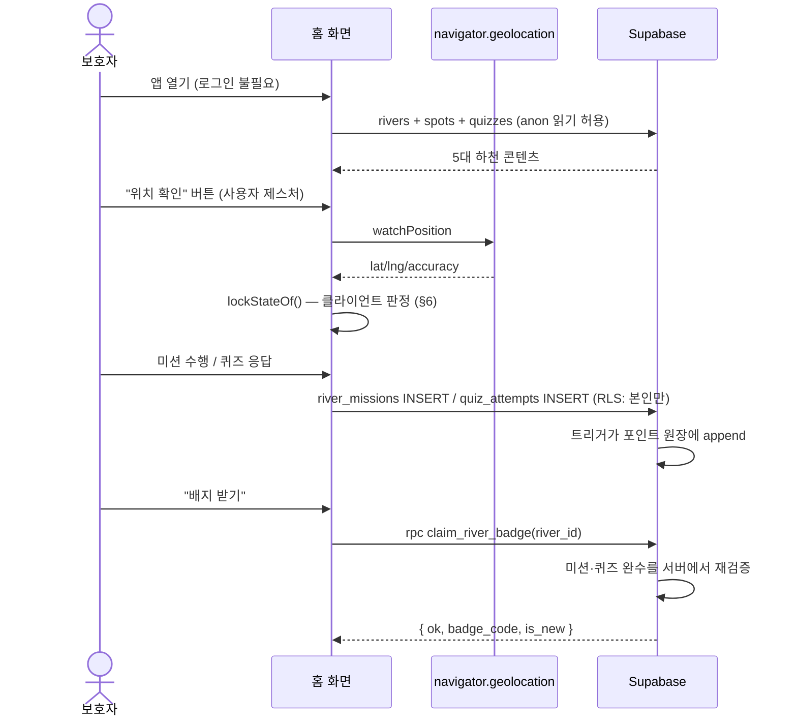

읽어야 할 지점: **잠금 해제는 클라이언트가 판정하지만, 기록이 남는 순간은 전부 서버가 다시 검증합니다.**
근거와 그 한계는 §6, `docs/SECURITY.md` §7에 있습니다.

---

## 2. 기술 선택과 그 이유

| 레이어 | 선택 | 이유 |
|---|---|---|
| 앱 형태 | **모바일 웹 / PWA** (네이티브 아님) | 시범사업 최대 리스크는 "다운로드 장벽". 하천 입구 QR을 찍은 보호자에게 앱스토어 설치를 요구하면 그 자리에서 이탈합니다. 나들이는 이미 시작됐고 아이는 기다리지 않습니다 (PLAN.md §4.1) |
| 프론트 | React 18 + TypeScript + Vite | 인력 확보 용이. Vite는 dev 반응속도와 빌드 산출물이 모두 가벼움 |
| 서버 상태 | TanStack Query | 캐시 무효화 지점이 명시적. `invalidateQueries(riverKeys.all)` 한 줄로 진행률이 전 화면에서 갱신됨 |
| 지도 | 카카오맵 JS SDK | 국내 지도 반출 규제상 구글맵은 상세도가 제한됩니다. 국내 좌표계·POI 정확도 우위 |
| 스타일 | **Tailwind CSS** + CSS Modules 혼용 | 아래 참조 |
| 백엔드 | **Supabase** | 아래 참조 |
| 공간 질의 | **PostGIS** | 아래 참조 |
| 배포 | Vercel | SPA rewrite + 헤더 제어(`vercel.json`)만 있으면 되는 정적 호스팅 |

### 왜 Supabase인가

세 가지가 동시에 필요했습니다: **관계형 스키마 + 행 단위 권한 + 공간 질의**.

- **인프라 운영 인력이 0인 시범사업**입니다. Postgres·Auth·Storage·함수를 각각 운영하면 그 자체가 프로젝트가 됩니다.
- **RLS가 애플리케이션 코드 밖에 있다는 점**이 가장 큽니다. 이 앱의 권한 규칙(포인트 위조 방지, 사진 비공개, 도감 봉인)은
  전부 `supabase/migrations/0006_rls.sql`에 선언으로 존재하고, 프론트엔드가 어떤 실수를 해도 규칙 자체는 남습니다.
  실제로 이 구조가 여러 번 저희를 구했습니다 — `docs/SECURITY.md` §5의 사고 5건 중 3건은 "앱 코드는 멀쩡한데 DB가 뚫려 있던" 유형입니다.
- **anon 키를 브라우저에 그대로 심을 수 있다**는 것이 QR 진입 시나리오와 맞습니다. 미로그인 방문자가 코스를 둘러보는
  경로가 별도 백엔드 없이 성립합니다.

포기한 것: Supabase에 강하게 결합됩니다. RLS 정책·`SECURITY DEFINER` 함수·`auth.uid()`는 이식 시 전부 다시 써야 합니다.
시범사업 규모에서는 이 결합이 이득이라고 판단했습니다.

### 왜 PostGIS인가

`spots.geom`을 `geography(Point, 4326)`으로 둡니다. `geometry`가 아니라 `geography`인 이유가 핵심입니다.

- `geography`면 `ST_DWithin` / `ST_Distance`가 **도(degree)가 아니라 미터**로 계산됩니다.
  투영 변환 없이 "반경 1500m 이내"를 그대로 쓸 수 있습니다.
- 클라이언트 거리 계산은 **조작 가능**합니다. 기록이 남는 판정(`verify_checkin`)은 반드시 서버에서 합니다.
- 대안은 애플리케이션에서 Haversine을 도는 것인데, 그러면 인덱스를 못 씁니다.
  지금은 스팟이 5개라 차이가 없지만, 스팟 단위로 정밀화하면(§6) 바로 필요해집니다. GiST 인덱스가 이미 걸려 있습니다.

`lat`/`lng`는 별도 컬럼이 아니라 **생성 컬럼(generated always as stored)**입니다.
`geom`이 단일 진실이고 둘은 파생값이라 드리프트가 구조적으로 불가능합니다.

### 왜 Tailwind인가 (그리고 그 대가)

- 하천마다 색 테마가 다릅니다(blue/amber/emerald/cyan/teal). Tailwind면 테마 키 → 클래스 묶음 매핑
  (`src/features/rivers/theme.ts`)만으로 5개 하천이 처리됩니다.
- **⚠️ 함정을 실제로 밟았습니다.** Tailwind는 소스를 **정적 스캔**하므로 런타임에 조립한 클래스 문자열
  (`` `bg-${theme}-500` ``)은 빌드에서 제거됩니다. 그래서 DB의 `rivers.theme`에는 색 키만 넣고
  클래스 문자열은 넣지 않습니다 — 마이그레이션 `0013`의 컬럼 주석에 이 규칙이 못박혀 있습니다.
- **대가**: Tailwind와 CSS Modules(디자인 토큰 `var(--c-surface)` 등)가 한 화면에 섞여 있습니다.
  커밋 `75ab74b`에서 이 혼용이 사고로 이어졌습니다 — Tailwind 도입 때 `global.css`를 새로 쓰며 `:root`의
  토큰 정의 9종이 지워졌고, 142곳의 `var(...)` 선언이 통째로 무효가 됐습니다. 여기에 Tailwind preflight가
  `input`/`button`의 기본 배경을 제거하는 것이 겹쳐 입력창·버튼이 투명해졌습니다.
  **둘 중 하나만 있었으면 드러나지 않았을 문제입니다.** 원본 토큰 값은 git 이력에 남아 있지 않아
  복원이 아니라 Tailwind 팔레트에 맞춘 재구성입니다.

---

## 3. 데이터 모델

### 3.1 ERD (주요 테이블)

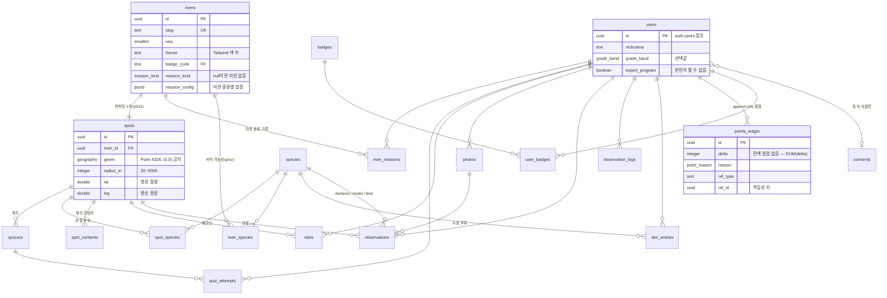

### 3.2 왜 `spots`를 없애지 않고 하천당 1개로 줄였는가

요구사항은 **"하천당 스팟을 없애고 하천을 하나로 취급"**이었습니다. 하지 않았습니다. 이유는 하나입니다.

`spots`를 참조하는 **NOT NULL FK가 6개**입니다: `quizzes`, `visits`, `photos.spot_id`(nullable),
`observations`, `spot_species`, `spot_contents`. 테이블을 드롭하면 이들이 연쇄로 무너집니다.

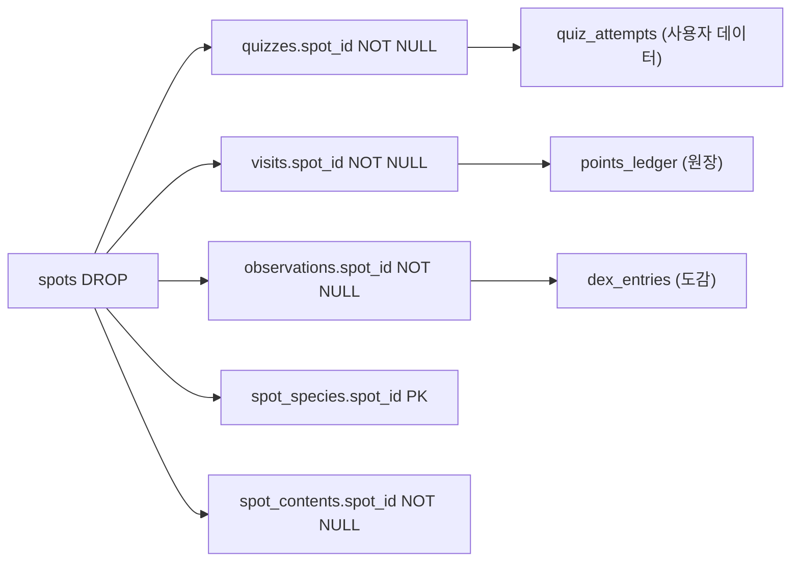

대신 **하천당 스팟 1개 = 하천 자신**으로 축소했습니다 (마이그레이션 `0013`).

- 데이터 모델은 그대로 살아 있고, **UI가 스팟 개념을 노출하지 않으므로** 사용자에게는 "하천 하나"로 보입니다.
- 스키마 변경 위험 0, 되돌리기도 쉽습니다. 나중에 코스를 다시 6~8스팟으로 넓힐 때 `seq`만 늘리면 됩니다.
- 대가: 코드가 **"하천당 스팟은 1개"라는 가정**을 갖게 됐습니다.
  `queries.ts`가 `(r.spots ?? [])[0]` 하나만 읽습니다. 스팟이 2개가 되는 순간 조용히 첫 번째만 쓰입니다.
  주석으로 못박아 두었지만 타입이 강제하지는 못합니다.

### 3.3 원장(ledger) 방식 — 잔액 컬럼이 없습니다

`users.points` 같은 정수 컬럼을 두지 않고 `points_ledger`에 증감 행만 append합니다.

- 잔액 컬럼은 동시 갱신에서 유실되기 쉽고 **"이 포인트가 왜 생겼지?"를 추적할 수 없습니다.**
- 원장이면 잔액은 `SUM(delta)` (`point_balance()` / `v_point_balances` 뷰).
  굿즈 교환 분쟁·부정 적립 회수·통계가 전부 이 테이블 하나에서 해결됩니다.
- **멱등성이 DB에 있습니다**: `(user_id, reason, ref_type, ref_id)` 부분 유니크 인덱스.
  오프라인 큐 재전송이 그대로 이중 적립이 되는 것을 DB가 막습니다. `award_points()`는 `on conflict do nothing`이라
  재전송이 예외가 아니라 정상 흐름입니다.
- 정정은 행을 고치는 게 아니라 **반대 부호의 보정 행**을 넣습니다(회계와 동일). UPDATE/DELETE는 트리거가 차단합니다.

이 append-only 결정이 나중에 **계정 삭제를 막는 문제**를 만들었습니다 — 경위와 해결은 `docs/SECURITY.md` §4에 있습니다.

### 3.4 관찰(observations)과 도감(dex_entries)을 분리한 이유

같은 종을 열 번 만나도 **아이가 보는 카드는 1장**이지만, **데이터로서의 가치는 10건 전부**에 있습니다.

- `observations` — 관찰 이벤트 전량. `declared_species_id`(아이가 고른 종, NOT NULL)와
  `model_species_id`(모델 추론, nullable)를 **각각 보존**합니다.
  둘의 일치율이 곧 아이의 식별 능력 성장 곡선이고, 불일치는 그대로 검수 큐이자 콘텐츠 개선 지표입니다.
- `dex_entries` — `(user_id, species_id)` 복합 PK. 종당 1행 + `count`.

`declared_species_id`가 NOT NULL인 것은 교육 설계입니다. 앱이 자동으로 "왜가리입니다" 하면
아이는 아무것도 배우지 않고 사진 찍는 기계의 조수가 됩니다.

---

## 4. 콘텐츠를 DB가 정의하는 구조

프로토타입(`example_html.html`)은 **하천마다 렌더 함수가 하나씩**이었습니다.
`if (river.id === 'suyeong') { ... }` — 하천이 늘 때마다 코드도 늘어납니다.

여기서는 `mission_kind` ENUM + `mission_config` JSONB로 **DB가 미션을 정의**합니다.

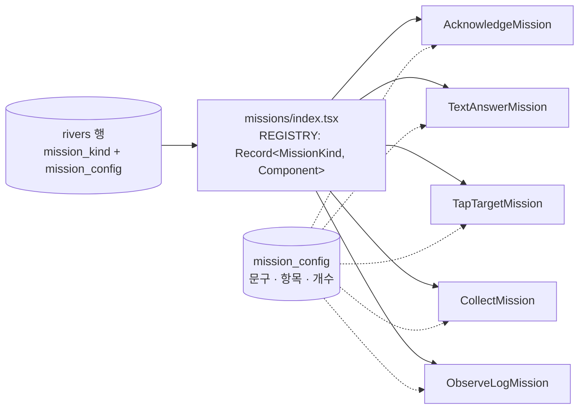

| `mission_kind` | 상호작용 | 하천 | `mission_config` 형태 |
|---|---|---|---|
| `acknowledge` | 읽고 인증 버튼 | (폴백) | `{cta, done}` |
| `text_answer` | 정답 단어 입력 | — | `{prompt, placeholder, accept[], hint}` |
| `tap_target` | 움직이는 대상 탭 | 온천천(수달) | `{emoji, label, done}` |
| `collect` | N개 수집 | 동천(플로깅) | `{items[], target, done}` |
| `observe_log` | 관찰 항목 선택 + 기록 | 대천천 | `{fields[{key,label,options[]}], cta, done}` |

**6번째 하천을 추가할 때 코드를 고칠 필요가 없습니다. 행 하나만 넣으면 됩니다.**

설계상 신경 쓴 지점 두 가지:

- **알 수 없는 kind는 `AcknowledgeMission`으로 폴백**합니다(`missionComponentFor`).
  미션 화면이 통째로 사라지면 그 하천은 **영원히 완수 불가**가 되기 때문입니다.
- `mission_config`는 jsonb라 **런타임에 뭐가 들어올지 타입이 보장하지 못합니다.**
  TS 인터페이스의 필드가 전부 optional이고, 각 컴포넌트는 하드코딩된 한국어 기본값을 갖습니다.
  `collectTarget()`은 `Math.min(Math.max(target,1), Math.max(items.length,1))`로 **잘못된 JSONB를 클램프**해
  화면이 항상 끝날 수 있게 만듭니다.

`theme` 컬럼도 같은 철학입니다 — Tailwind 클래스 문자열이 아니라 **색 키**만 DB에 넣고,
`theme.ts`가 미리 정의된 클래스 묶음에 매핑합니다(§2 Tailwind 정적 스캔 문제).

---

## 5. 진행 상황과 완수 판정 — "없는 단계는 통과"

### 5.1 문제

5대 하천의 구성이 **전부 다릅니다.** 이것은 누락이 아니라 오너가 확정한 콘텐츠입니다.

| 하천 | 퀴즈 | 미션 |
|---|---|---|
| 수영강 | 1문항 | **없음** |
| 부전천 | 1문항 | **없음** |
| 온천천 | 1문항 | `tap_target` |
| 동천 | **0문항** | `collect` |
| 대천천 | 1문항 | `observe_log` |

"미션 완료 **AND** 전 퀴즈 정답"을 그대로 쓰면 **수영강·부전천·동천 셋이 영원히 미완수**가 되고
배지 3개를 아무도 받을 수 없습니다. **에러도 안 나고 진행률만 안 오릅니다** — 가장 찾기 어려운 종류의 버그입니다.

### 5.2 규칙

> **없는 단계는 이미 통과한 것으로 취급한다.**

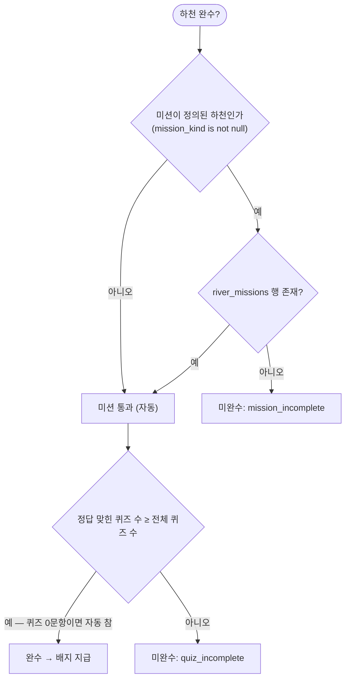

### 5.3 같은 규칙이 두 곳에 있습니다 — 그리고 반드시 같아야 합니다

**클라이언트** (`src/features/rivers/types.ts:86`)

```ts
export function isRiverComplete(r: RiverView): boolean {
  const missionOk = !r.hasMission || r.missionDone;
  const quizOk = r.quizzes.every((q) => r.quizSolvedIds.has(q.id)); // 0문항이면 true
  return missionOk && quizOk;
}
```

**서버** (`supabase/migrations/0013_river_missions.sql`, `claim_river_badge()`)

```sql
-- 미션이 정의된 하천만 미션 완료를 요구합니다.
if v_river.mission_kind is not null
   and not exists (select 1 from public.river_missions
                    where user_id = v_uid and river_id = p_river_id) then
  return jsonb_build_object('ok', false, 'reason', 'mission_incomplete');
end if;
...
-- 퀴즈가 0문항이면 이 조건은 자동으로 통과합니다(0 >= 0).
if v_solved < v_total then ...
```

**왜 두 곳에 두는가 (중복이 아니라 역할 분담입니다)**

| | 클라이언트 `isRiverComplete()` | 서버 `claim_river_badge()` |
|---|---|---|
| 목적 | 화면 표시 — "완료!" 뱃지 표시, 축하 연출 | **실제 지급** |
| 신뢰 | 신뢰하지 않음 (조작 가능) | 유일한 권위 |
| 실패 시 | 화면이 어긋남 | `{ok:false, reason}` 반환, 지급 안 됨 |

**두 규칙이 어긋나면 나타나는 증상**: 화면은 "완료!"인데 배지 버튼을 눌러도 `ok:false`가 돌아오거나,
반대로 화면은 미완수인데 서버는 지급 가능한 상태가 됩니다. 어느 쪽도 에러가 아니라 **말없는 불일치**입니다.
그래서 양쪽 소스에 서로를 가리키는 주석을 남겼습니다.

`river_progress()`(서버)도 같은 규칙으로 `mission_done`을 계산합니다 —
`r.mission_kind is null or exists(river_missions ...)`. **세 곳입니다.** 규칙을 바꾸면 세 곳을 함께 고쳐야 합니다.

> 미션 로직(`missions/logic.ts`)의 `isCompleteWith()`는 규칙을 다시 쓰지 않고
> `isRiverComplete()`에 그대로 위임합니다. 낙관적 축하 연출용 래퍼일 뿐입니다.

---

## 6. 위치 처리

### 6.1 지오펜스 구조

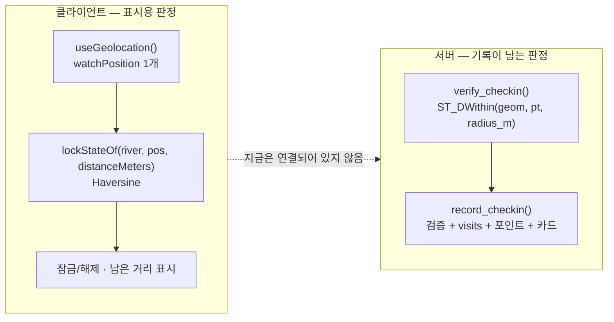

**핵심**: 두 계층이 존재하고, **현재 잠금 해제는 클라이언트 계층만 씁니다.**
서버 계층(`verify_checkin`/`record_checkin`)은 이미 구현되어 있고 `authenticated`에게 열려 있지만,
잠금 해제 조건에 배선되어 있지 않습니다. 의도된 선택이며 근거는 §10에 적었습니다.

### 6.2 위치 권한과 정확도 UX

- **`useGeolocation()`은 자동 시작하지 않습니다.** 맥락 없는 권한 요청은 거부되고, 한 번 거부되면
  되돌리기가 번거롭습니다. 반드시 사용자 제스처에서 `start()`를 부릅니다.
- 보안 컨텍스트(https/localhost) 아님을 `'insecure'` 상태로 **별도 구분**합니다.
  "위치를 못 받았어요"와 "이 주소에서는 원래 안 됩니다"는 다른 문제입니다.
- **오차가 300m를 넘으면 거리를 단정하지 않습니다.** `POOR_ACCURACY_M = 300`.
  하천 반경이 1000~1500m라 300m 오차면 안팎이 뒤집힐 수 있습니다.
  이때는 `"위치가 흔들려서 정확하지 않아요"`를 덧붙입니다.
- **어디에도 "인증됨"이라는 문구를 쓰지 않습니다.** 클라이언트 판정이 인증인 척하면 안 되기 때문이고,
  테스트로 고정해 두었습니다.
- 앱 전체에서 `watchPosition` 구독은 **HomeScreen의 1개뿐**입니다. 화면마다 부르면 배터리가 그만큼 닳고,
  두 구독이 서로 다른 좌표를 들면 카드와 모달이 다른 거리를 말합니다.

### 6.3 하천을 "점"으로 근사한 한계 ⚠️

**이것이 현재 위치 처리의 가장 큰 구조적 약점입니다.**

하천은 길이 수 km의 **선**인데, 지금은 **점 하나 + 원형 반경**으로 근사하고 있습니다.

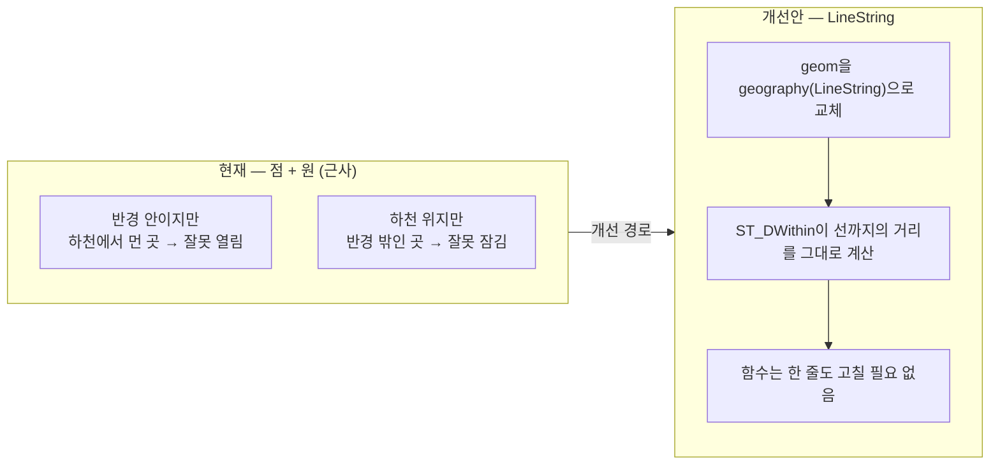

- `radius_m` 제약을 `20~300m` → `20~5000m`로 완화했습니다(`0015`).
  300m로는 **온천천 산책로 한가운데 서 있어도 열리지 않습니다.** 현재 값은 1000~1500m입니다.
- **근본 해법은 `geom`을 `geography(LineString)`으로 바꾸는 것**입니다. `ST_DWithin`은 점이든 선이든
  "그 도형까지의 거리"를 계산하므로 `verify_checkin` 함수 본문은 **한 줄도 고칠 필요가 없습니다.**
  필요한 것은 하천 중심선 좌표열(공공데이터 또는 실측)뿐입니다.
- 지금 하지 않은 이유: 데모 우선. 좌표열 확보와 검증이 현장 답사 없이는 불가능합니다.

### 6.4 (0,0) 금지 제약 — 자리표시자가 유효 좌표가 되던 문제

원래 설계는 "좌표 미실측 자리표시자로 (0,0)을 넣는다"였습니다(`seed/0002`).
그런데 `RiverView.lat/lng`는 `number`라 스팟이 없으면 0으로 떨어지고,
그러면 부산에서 약 9,700km 떨어진 **기니만(Null Island)**까지의 거리가 계산되어
화면에 **"약 9,700km 더 가야 해요"**가 떴습니다. **에러가 아니라 그럴듯한 오답입니다.**

앱 쪽 방어(`hasCoordinates` / `isUsablePoint`)도 넣었지만, 애초에 그런 행이 생기지 못하게
DB에 `spots_geom_not_null_island` CHECK 제약을 걸었습니다(`0016`).
조용히 이상한 숫자가 보이는 대신 **INSERT가 큰 소리로 실패**합니다.

> 교훈: **없는 것과 0은 다릅니다.** 좌표를 모르면 스팟을 만들지 마세요.

### 6.5 시연용 위치 이동 패널

현장에 가지 않고 발표하기 위한 장치입니다(`src/features/dev/DemoLocationPanel.tsx`).

- 노출 조건: 개발 서버는 항상, 배포본은 `?demo=1`일 때만(이후 세션 동안 `sessionStorage`에 유지).
- **훅 안에서 가로챕니다.** 지도와 잠금 판정은 `useGeolocation()` **하나**를 보므로,
  그 안에서 좌표를 덮어쓰면 두 곳이 자동으로 따라옵니다. 화면마다 가짜 위치 상태를 따로 뒀다면
  **지도는 옮겨졌는데 잠금은 안 풀리는** 어긋남이 생깁니다.
- **시연 중임을 숨기지 않습니다.** `GeoState.isSimulated`가 켜지면 버튼이 주황색으로 바뀝니다.
  위치를 속이는 도구가 조용히 도는 것은 위험하고, 발표에서 실제 GPS로 된 것처럼 보이면 안 됩니다.
- 시뮬레이션 좌표는 오차 5m로 보고해 "위치가 흔들려요" 경고를 피합니다.
- 코드 자체는 번들에 포함되므로 주소를 아는 사람은 켤 수 있습니다.
  **잠금 판정이 원래 클라이언트 측이라 새로운 우회 경로가 생기는 것은 아닙니다.**

---

## 7. 이미지 파이프라인

### 7.1 전체 흐름

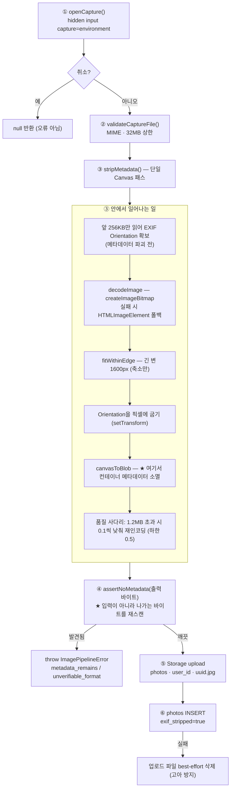

> ⚠️ **문서상의 5단계는 실제로 5번의 패스가 아닙니다.** EXIF 제거·리사이즈·압축은
> **단일 Canvas 패스 하나**입니다. 검증만 별도 패스입니다.

### 7.2 왜 업로드 "전"이어야 하는가

이 앱은 체크인에서 좌표를 받아 판정만 하고 폐기하도록 설계됐습니다(그 정책은 `0010`에서 철회됐지만 §10.7).
그런데 **사진 EXIF에는 촬영 GPS가 그대로 박혀 있습니다.**

> 서버에 도착한 뒤 지우는 것은 이미 늦습니다 — 그 시점에 **이미 수신·처리한 것**이 되기 때문입니다.
> 판별 API로 보내는 경우라면 국외 이전까지 걸립니다.

그래서 제거는 **기기를 떠나기 전**이어야 합니다.

### 7.3 왜 "잘라내기"가 아니라 "픽셀만 새로 굽기"인가

EXIF 세그먼트를 찾아 잘라내는 방식은 놓치는 곳이 생깁니다 — XMP, IPTC, MPF 내장 원본, EOI 뒤 트레일러…

Canvas는 **디코드된 픽셀만** 들고 있으므로, 캔버스에서 새로 인코딩하면 원본 컨테이너의 모든 부가 정보가
**구조적으로** 사라집니다. **"무엇을 지울지"를 열거하지 않아도 되는 것**이 이 방식의 핵심 장점입니다.

**⚠️ 여기에 함정이 하나 있습니다 — EXIF Orientation.**
메타데이터를 버리면 회전 정보도 함께 사라집니다. 방향을 반영하지 않고 재인코딩하면
**세로로 찍은 사진이 옆으로 누운 채** 저장됩니다.
→ 방향은 **바이트에서 직접 읽어 픽셀에 굽고**, 결과물에는 남기지 않습니다.

여기에 더해, 브라우저마다 디코더가 Orientation을 이미 적용하는지가 다릅니다.
그래서 `decoderAppliesOrientation()`이 **런타임 프로브**를 돕니다 — 손으로 만든 36바이트 APP1 세그먼트를
가진 4×2 JPEG를 디코드해 2×4가 나오는지 확인하고 결과를 캐시합니다. 이중 회전을 막기 위한 장치입니다.

### 7.4 왜 "제거했다"가 아니라 "검증한다"인가

> Canvas 재인코딩은 이론상 메타데이터를 남기지 않습니다. 하지만 그건 **"브라우저 구현이 그럴 것이다"라는 가정**입니다.
> 이 앱에서 그 가정이 틀리면 촬영 위치가 서버로 들어갑니다.
> 가정에 기대지 않고, **나가는 바이트를 매번 직접 읽어 확인**합니다.

`metadataScan.ts`는 **DOM 의존성이 없는 순수 바이트 파서**입니다.

| 포맷 | 방식 | 허용 목록 | 걸리는 것 |
|---|---|---|---|
| JPEG | 마커 세그먼트 워크 | `APP0/JFIF`, `APP0/JFXX`, `APP2/ICC_PROFILE`, `APP14/Adobe` | `APP1/Exif`, `APP1/XMP`, `APP13/Photoshop(IPTC)`, `APP2/MPF`, `COM`, EOI 뒤 트레일러 |
| PNG | 청크 화이트리스트 | IHDR/PLTE/IDAT/IEND, tRNS/gAMA/cHRM/sRGB/iCCP/… | `eXIf`, `tIME`, `tEXt/zTXt/iTXt`, IEND 뒤 잔여 바이트 |
| WebP | 청크 화이트리스트 | `VP8 `, `VP8L`, `VP8X`, `ALPH`, `ANIM`, `ANMF`, `ICCP` | `EXIF`, `XMP ` |
| GIF/HEIF/미상 | — | — | `parsed:false` → **무조건 거부** |

**화이트리스트인 것이 핵심입니다.** 블랙리스트면 모르는 세그먼트가 통과합니다.
`assertNoMetadata`는 파싱 자체가 안 되면 `unverifiable_format`으로 **거부**합니다 —
**"검증 불가는 안전으로 간주하지 않습니다."**

이 스캐너가 보는 것은 **컨테이너 수준 메타데이터**뿐입니다. 픽셀에 숨겨진 스테가노그래피는 대상이 아니며,
Canvas 재인코딩이 픽셀만 남기므로 "EXIF/GPS가 실려나가는가"라는 질문에는 이것으로 답이 됩니다.

### 7.5 실패를 삼키지 않습니다

> 메타데이터 제거·검증에 실패했는데 조용히 원본 Blob을 돌려주면, 호출부는 "안전한 이미지"를 받았다고 믿고
> 그대로 업로드합니다. 그 순간 설계 전체가 무너집니다.
> 따라서 **이 모듈의 모든 실패 경로는 예외로만 빠져나갑니다.**

오류 코드 8종: `empty_file`, `unsupported_type`, `too_large`, `decode_failed`, `encode_failed`,
`canvas_unavailable`, `unverifiable_format`, `metadata_remains`.

**원본을 그대로 돌려주는 경로는 코드 어디에도 없습니다.**

### 7.6 `browser-image-compression`을 기본 경로로 쓰지 않는 이유

의존성에는 있지만 **기본 경로가 아닙니다**(`options.useLibrary`일 때만).

- 이 라이브러리에는 **`preserveExif` 옵션**이 있습니다. 실수로 켜면 그대로 유출입니다.
- `useWebWorker: true`면 `importScripts`로 **jsdelivr CDN을 로드**합니다 — 외부 스크립트 의존이 생깁니다.
- 그래서 쓸 때도 `preserveExif: false`, `useWebWorker: false`를 강제하고,
  결과물을 다시 `verifyBlobStripped`로 검증하며, **검증에 실패하면 라이브러리 출력을 버리고 Canvas 경로로 다시 굽습니다.**

### 7.7 압축 파라미터의 근거

긴 변 **1600px** / JPEG 품질 **0.8** / 목표 **1.2MB 이하**.

1. 하천변에서 셀룰러로 올립니다. 12MP 원본(3~6MB)을 그대로 올리면 그게 곧 데이터 요금입니다.
2. 종 판별에 1600px면 충분합니다. **병목은 해상도가 아니라 "30m 밖 백로가 20픽셀"이라는 촬영 조건**이라,
   원본을 보내도 정확도가 올라가지 않습니다.

> 압축은 이 모듈의 **부차 목표**입니다. 1순위는 메타데이터 제거이고, 압축 경로가 무엇이든
> 결과물은 반드시 검증을 통과해야 합니다.

### 7.8 저장 경로도 메타데이터입니다

`photos/{user_id}/{uuid}.{ext}`

- 첫 폴더명이 소유자 uid라 Storage 정책이 `(storage.foldername(name))[1] = auth.uid()::text`로 **O(1) 판정**합니다.
- **파일명에 촬영 시각이나 좌표를 넣지 마세요 — 경로도 메타데이터입니다.**
- `photos` INSERT 시 `is_public`/`review_status`를 **보내지 않습니다.**
  `photos_insert_self` 정책이 `review_status='pending' AND NOT is_public`을 요구하고 둘 다 컬럼 기본값이기 때문입니다.
- INSERT가 실패하면 업로드된 파일이 고아로 남으므로 best-effort로 삭제합니다.
  삭제 실패는 **무시합니다** — 여기서 또 던지면 사용자는 원인이 두 개인 오류를 보게 됩니다.

### 7.9 제스처 경계

`captureAndUpload()`는 **사용자 제스처 핸들러 안에서 직접** 불러야 합니다.
`await` 뒤로 미루면 브라우저가 파일 선택창을 차단합니다.
호출부(`MissionPhoto.tsx`)에 `↓↓ 여기가 제스처 경계입니다. 이 위에 await 를 넣지 마세요.`라고 표시되어 있습니다.

### 7.10 종 판별기(classifier)와의 관계 — 현재 연결되어 있지 않습니다

`src/lib/classifier/`는 완성되어 있고 468개 테스트 중 상당수가 이것을 검증하지만,
**앱 화면 어디에서도 호출되지 않습니다.**

- `getClassifier()` / `createClassifier()`는 classifier 모듈 밖에 **호출자가 없습니다.**
- `VITE_CLASSIFIER_ENGINE` 기본값은 `'none'`입니다.
- Claude 어댑터는 Anthropic API를 **직접 부르지 않습니다** — Edge Function 경유로만 설계돼 있고,
  그 Edge Function은 배포된 적이 없습니다(§10.3).

설계 자체는 남길 가치가 있습니다:

- **후보 압축** — `spot_species × 촬영 월`로 "전 세계 10만 종" 열린 문제를 **3~10 분류 닫힌 문제**로 바꿉니다.
- **윤리 필터가 두 곳에서 다른 일을 합니다.**
  `candidates.ts`에서는 **후보에서 제외**(목록에 올리는 순간 아이가 돌을 뒤집으므로),
  `routing.ts`에서는 **강제 검수 대상**으로 만듭니다. 제철 후보가 0건일 때의 폴백은 **계절 필터만 완화하고
  윤리 필터는 절대 완화하지 않습니다.**
- **아이의 선택은 입력이지 출력이 아닙니다.** `declared_species_id`는 프롬프트에 들어가지 않습니다(앵커링 방지).
  라우팅은 0~6단계 순서가 고정돼 있고, 모델 신뢰도가 NaN이거나 범위를 벗어나면 **0으로 클램프**해
  잘못된 어댑터 출력이 자동 확정으로 새지 않게 합니다.

---

## 8. 프론트엔드 구조

### 8.1 feature 폴더 + 배럴

```
src/
  App.tsx              ← 오케스트레이터 (유일한 조립 지점)
  lib/                 ← 트랙 공용 계약
    supabase.ts        ← anon 클라이언트 싱글턴
    session.ts         ← useSession() 단일 세션
    geo.ts             ← useGeolocation / distanceMeters
    image/  photos.ts  ← 이미지 파이프라인
    points/ classifier/
  features/
    auth/  dex/  map/  quiz/  rivers/  dev/
      index.ts         ← 배럴 = 공개 API. 이 밖의 파일은 내부 구현
```

각 배럴 헤더에 **"이 배럴 밖의 파일은 내부 구현으로 봅니다"**가 명시되어 있습니다.
여러 트랙이 병렬로 작업하는 구조였기 때문에, **누가 무엇을 소유하는가**가 폴더 경계로 표현되어 있습니다.

### 8.2 단일 진입점 두 개

**`useRivers()` — 데이터** (`src/features/rivers/queries.ts`)

- 두 UI 트랙이 공유하는 단일 진입점. **각자 쿼리를 새로 짜지 마세요.**
  `queryKey`가 갈라지면 미션을 완료해도 다른 화면의 진행률이 안 바뀝니다.
- 콘텐츠 쿼리(`rivers → spots → quizzes` 중첩 select)와 진행 상황 쿼리(`rpc river_progress` + `quiz_attempts`)를
  **분리**하고 메모리에서 합칩니다. 콘텐츠는 anon도 읽히고, 진행 상황만 `enabled: Boolean(userId)`입니다.
- 모든 뮤테이션(`useCompleteMission` / `useAnswerQuiz` / `useClaimBadge`)이
  `onSuccess`에서 `invalidateQueries(riverKeys.all)`를 부릅니다.

**`useSession()` — 세션** (`src/lib/session.ts`)

- 두 트랙이 각자 `supabase.auth.getSession()`을 서로 다른 queryKey로 감싸면 캐시가 둘로 갈라집니다.
  로그인 직후 한쪽 화면만 갱신되는, 재현 어려운 버그가 됩니다.
- `staleTime: Infinity` — `onAuthStateChange`가 캐시에 직접 밀어넣으므로 재조회가 필요 없습니다.
- **커밋 `a2d075b`의 사고**: 예전 코드는 `if (!session) queryClient.clear()`였습니다.
  ① `onAuthStateChange`는 구독 직후 `INITIAL_SESSION`을 즉시 발화합니다 —
  미로그인 상태에서 이 훅을 쓰는 컴포넌트가 마운트될 때마다 **캐시 전체가 날아갔습니다.**
  로그인 모달을 여는 것만으로 하천·지도 데이터가 비워지고 다시 받아왔습니다(사용처 4곳 × 매번).
  ② `clear()`가 방금 넣은 세션 데이터까지 지워 왕복이 한 번 더 생겼습니다.
  → 지금은 `event === 'SIGNED_OUT'`일 때만 세션 외 쿼리를 `removeQueries`합니다.

`supabase` 클라이언트도 **싱글턴**입니다. 인스턴스마다 auth 상태·토큰 갱신 타이머·localStorage 구독을 들고 있어
둘을 만들면 세션이 갈라지고 "가끔 로그아웃되는" 버그가 됩니다.

### 8.3 의존 역전 — `renderMap` / `renderMissionModal`

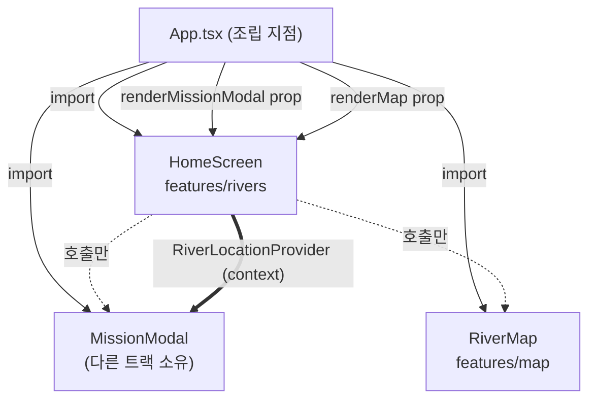

`HomeScreen`은 `MissionModal`도 `RiverMap`도 **import하지 않습니다.**
대신 렌더 함수를 prop으로 받습니다:

```ts
renderMissionModal?: (river: RiverView, onClose: () => void) => ReactNode;
renderMap?: (args: { rivers; position; selectedRiverId; onSelectRiver; onRequestLocation }) => ReactNode;
```

**왜**

- 직접 import하면 `HomeScreen → MissionModal → (열린 하천 상태·닫기 콜백) → HomeScreen` 순환이 생깁니다.
- 더 실질적으로는 **소유권 문제**입니다. 두 트랙이 병렬로 작업 중이라 같은 파일을 건드리면 충돌합니다.
  `features/rivers/index.ts` 배럴이 `MissionModal`을 **일부러 재수출하지 않습니다** —
  배럴이 그것을 참조하는 순간 두 트랙이 같은 파일을 놓고 부딪칩니다.
- 접합은 **App.tsx 한 곳**에서만 일어납니다. 조립 지점이 하나라 배선이 눈에 보입니다.
- 부수 효과: `renderMissionModal`이 없으면 카드를 눌러도 **조용히 아무것도 그리지 않습니다.**
  `HomeScreen`이 단독으로도 동작하므로 테스트가 쉬워집니다(테스트로 고정되어 있습니다).

**역전이 깨뜨린 것 하나**: 주입된 모달에는 prop으로 위치를 내려보낼 자리가 없습니다.
그래서 `HomeScreen`이 `RiverLocationProvider`가 되고 모달은 `useRiverLock(river)`으로 꺼내 씁니다.
provider가 없으면 **잠그지 않습니다** — 모달만 단독으로 띄우는 테스트에서 위치 때문에 아무것도 못 하게 되는 편보다
"잠금은 HomeScreen이 붙인다"가 덜 놀랍습니다.

### 8.4 라우팅 — 앱 전체를 `AuthGate`로 감싸지 않습니다

```tsx
{ path: '/',    element: <HomeScreen renderMap={...} renderMissionModal={...} /> }  // 미로그인 OK
{ path: '/dex', element: <DexContainer /> }                                         // 미로그인 OK
{ path: '/me',  element: <AuthGate><DexContainer /></AuthGate> }                    // 로그인 필요
...(import.meta.env.DEV ? [{ path: '/dev', element: <DevScreen /> }] : [])           // 운영 빌드 제외
```

`rivers`/`spots`/`quizzes`/`species`는 anon 읽기가 열려 있습니다.
미로그인 방문자가 먼저 둘러보고 **"해볼 만하네"**라고 판단한 뒤 가입하게 하려는 설계입니다(QR 진입 시나리오).
로그인을 요구하는 것은 **기록이 남는 화면뿐**입니다.

로그인이 **모달인 이유**: 라우트로 이동하면 지도·위치 권한·열어둔 하천이 전부 날아갑니다.

### 8.5 배포 설정 (`vercel.json`)

| 설정 | 없으면 생기는 일 |
|---|---|
| SPA rewrite `/(.*) → /index.html` | `/dex` 새로고침이 404 |
| `/sw.js` 캐시 금지 | 서비스워커가 캐시되면 배포해도 **옛 버전에 갇힙니다** |
| `/assets/*` immutable | (해시가 붙어 있으므로 안전) |
| `Permissions-Policy: geolocation=(self), camera=(self), microphone=()` | 서드파티 iframe이 위치·카메라를 요구할 수 있음 |
| `X-Content-Type-Options`, `Referrer-Policy` | MIME 스니핑 / 리퍼러 유출 |

PWA는 `vite-plugin-pwa`(Workbox). **하천변 통신 불안정** 대비로 정적 자산을 선캐싱하고,
도감 일러스트는 `CacheFirst` 30일입니다.

---

## 9. 테스트 전략

### 9.1 두 층의 역할 분담

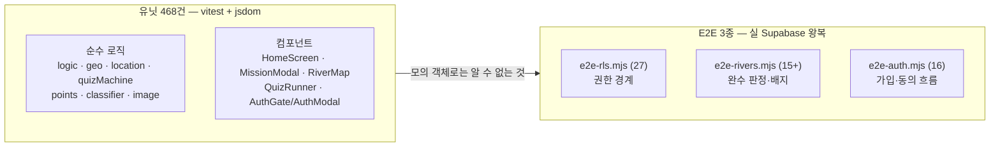

| | 유닛 468건 | E2E 3종 |
|---|---|---|
| 대상 | **결정 규칙** — 이 입력에 이 판단이 맞는가 | **권한 경계** — DB가 실제로 막는가 |
| 실행 | `npm test` (약 11초) | `node scripts/e2e-rls.mjs` (수동, 실 프로젝트 왕복) |
| 잡는 것 | 로직 회귀, 렌더 조건, 잘못된 JSONB 처리 | RLS 구멍, GRANT 누락, 트리거 무력화 |
| **잡지 못하는 것** | **RLS는 코드가 아니라 DB에 있어 mock으로 검증 불가** | 로직 세부, 렌더링 |

**핵심**: 이 프로젝트의 보안 규칙은 **애플리케이션 코드 밖(Postgres 정책·트리거)**에 있습니다.
유닛 테스트가 몇 개든 그것을 검증할 수 없습니다. 실제로 `docs/SECURITY.md` §5의 취약점 5건 중
**3건은 E2E가 발견했습니다** — 유닛 테스트는 전부 초록불이었습니다.

### 9.2 유닛 (측정값)

```
npx vitest run
  Test Files  31 passed (31)
       Tests  468 passed (468)
    Duration  ~11s
```

- 테스트 파일은 소스 옆에 나란히(`*.test.ts(x)`). 별도 `tests/` 디렉터리 없음.
- 환경은 `jsdom`. **`@testing-library/react` 의존성이 없습니다** — 컴포넌트 테스트는 직접 만든 렌더 헬퍼를 씁니다.
  (의존성 하나를 줄인 대신 헬퍼 유지 비용이 생깁니다. 트레이드오프로 기록해 둡니다.)
- 특기할 만한 고정 사항:
  - "**어디에도 '인증됨' 문구를 쓰지 않는다**"가 테스트로 고정되어 있습니다(§6.2).
  - "`renderMissionModal`이 없으면 카드를 눌러도 **조용히 아무것도 그리지 않는다**"(§8.3).
  - `pointsDeltaForCorrection`이 리터럴 타입 `0`을 반환합니다 — **타입 수준의 회귀 트립와이어**입니다.

### 9.3 E2E — 왜 실제 anon 클라이언트로 도는가

세 스크립트 모두 같은 규율을 지킵니다:

> **`service_role`은 계정 생성·정리에만 씁니다. 모든 단언은 anon 키 클라이언트로 수행합니다.**

그래야 RLS가 실제로 평가됩니다. service_role로 검증하면 정책을 우회하므로 **아무것도 증명하지 못합니다.**

**`e2e-rls.mjs` (27건) — 권한 경계**
직접 INSERT 차단 3종(`points_ledger`/`dex_entries`/`visits`), 자가 승격 차단, 동의 없는 체크인 거부,
`ST_DWithin` 실패 모드(`too_far`/`low_accuracy`), 포인트 정확값(체크인 10 + 장소카드 20+20 = **50**),
같은 날 재체크인 시 잔액 불변, `expert_only` 종이 후보에 새지 않음, 남의 도감 0행,
원장 UPDATE 차단, **그리고 사칭 테스트** — `p_user_id`에 피해자 uuid를 넣고 피해자 잔액이 0으로 남는지.

**`e2e-rivers.mjs` (15건+) — 완수 판정**
하천 구성을 **문자열로 통째 고정**합니다:
`수영강:없음/퀴즈1 부전천:없음/퀴즈1 온천천:tap_target/퀴즈1 동천:collect/퀴즈0 대천천:observe_log/퀴즈1`.
그리고 **미션 없는 하천이 시작부터 `mission_done=true`인지**, 퀴즈 0문항 하천이 `mission_incomplete`로만 막히는지 —
즉 §5의 "없는 단계는 통과" 규칙을 실 DB에서 검증합니다. 배지 재수령 멱등성, 퀴즈 재응답 시 포인트 불변도 확인합니다.

**`e2e-auth.mjs` (16건) — 가입·동의**
★ **anon 클라이언트로 가입**합니다. Admin API로 만든 계정은 "Confirm email"을 건너뛰어 테스트가 무효가 되기 때문입니다.
핵심은 5번: **`consent_id = NULL`이면 `record_checkin`이 `consent_required`로 거부한다** —
"로그인됐고 화면도 정상인데 아무것도 저장되지 않는" 상태를 만든 실제 버그(`1018338`)를 고정한 것입니다.
12b번은 로그아웃 상태에서도 미션 없는 하천이 `mission_done`으로 나오는지를 확인합니다.

### 9.4 테스트 전략의 빈틈 (정직하게)

- **E2E 3종은 `package.json` 스크립트에 등록되어 있지 않습니다.** 수동 실행이고, CI가 없습니다
  (`.github/` 디렉터리 자체가 없습니다). 누가 실행을 잊으면 아무도 모릅니다.
- E2E는 **원격 실 프로젝트**에 붙습니다. 로컬 Supabase 스택을 쓰지 않으므로 실행에 네트워크와 키가 필요하고,
  실패 시 테스트 계정이 남을 수 있습니다(`finally`에서 정리하지만 프로세스가 죽으면 남습니다).
- `e2e-rls.mjs` 2번 단언은 **종 개수 44를 하드코딩**합니다. 시드가 늘면 무관한 이유로 실패합니다.
- **클라이언트/서버 중복 모듈에 계약 테스트가 없습니다.**
  `src/lib/classifier/{routing,candidates,prompt}.ts`와 `supabase/functions/classify/*`는
  의도적인 복제본인데, 둘을 묶는 자동 검사가 없습니다. 헤더 주석이 "한쪽만 고치지 마세요"라고
  **부탁**할 뿐입니다. (게다가 서버 쪽 EXIF 스캐너는 화이트리스트가 아니라 블랙리스트라 이미 더 관대합니다 —
  `docs/SECURITY.md` §7.)
- **린터가 없습니다** — ESLint/Prettier 의존성이 없습니다. 타입 검사(`tsc -b --noEmit`)만 있습니다.

---

## 10. 알려진 한계 (숨기지 않은 목록)

> 아래는 전부 **확인된 사실**입니다. 추정은 "모른다"고 적었습니다.

### 10.1 하천 좌표가 미검증 근사값 ⚠️

`0015`가 넣은 5대 하천 좌표는 **각 하천의 잘 알려진 접근 지점을 기준으로 한 근사값**이며
**현장 답사로 확인하지 않았습니다.**

```
suyeong      129.1256, 35.1729  r=1500  수영교 일대
bujeon       129.0594, 35.1583  r=1000  부전동 서면 일대
oncheoncheon 129.0784, 35.2049  r=1500  온천천 시민공원
dongcheon    129.0561, 35.1417  r=1000  범천동 일대
daecheon     129.0128, 35.2344  r=1200  화명동 일대
```

확인한 것은 "부산 범위(위도 34.9~35.4, 경도 128.7~129.35) 안에 있는가"뿐입니다.
**운영 배포 전 실측으로 교체해야 합니다.** 그 전에는 잠금 해제 거리 판정을 신뢰하면 안 됩니다.

같은 문제가 온천천 6스팟 시드(`seed/0002`)에도 있습니다 — 좌표를 **지어내지 않아** 전부 (0,0)입니다.
`0016`의 제약 때문에 이제 그 시드는 **실행되지 않습니다**(§10.7 참조).

### 10.2 잠금 판정이 클라이언트 측이라 우회 가능 — 의도된 선택

`lockStateOf()`는 브라우저에서 Haversine 거리를 계산합니다. 개발자도구로 조작할 수 있습니다.

**지금 단계에서 이렇게 두는 근거 두 가지:**

1. **미로그인 방문자도 "가까이 가면 열린다"를 체험할 수 있어야 합니다.**
   서버 판정을 조건에 넣으면 로그인이 강제되고, QR로 들어온 사람이 앱을 이해하기 전에 가입 화면을 만납니다.
2. **잠금 해제 자체는 서버에 아무 기록도 남기지 않습니다.**
   기록이 남는 순간(미션 완료·퀴즈 응답·배지 수령)은 이미 RLS와 `claim_river_badge`가 지키고 있습니다.
   즉 **우회해서 얻을 수 있는 것은 "화면을 미리 보는 것"뿐**입니다.

**대가**: 배지를 부정하게 얻을 수 있습니다. 미션은 앱 안의 상호작용(버튼 탭)이라 서버가 검증할 물리적 사실이 없고,
퀴즈는 정답이 클라이언트로 내려갑니다. 시범사업 단계에서 수용했습니다.

**막으려면**: `record_checkin(verify_checkin)`을 잠금 해제 조건에 넣으세요. 그 함수는 **이미 있고
`authenticated`에게 열려 있습니다.** 서버가 `ST_DWithin`으로 다시 판정합니다.

### 10.3 `classify` Edge Function은 배포·실행된 적이 없습니다

**확인 방법과 결과**: 리포지토리 전수 검색 + 실 프로젝트 조회.

- `supabase/config.toml` **없음**. `deno.json` / `import_map.json` **없음**.
- CI **없음** — `.github/` 디렉터리 자체가 없고 `*.yml`/`*.yaml`이 리포지토리 어디에도 없습니다.
- 배포 스크립트 **없음** — `package.json`에 `dev/build/preview/typecheck/test/test:watch`뿐.
  Supabase CLI가 의존성에 없습니다.
- `vercel.json`은 **프론트엔드만** 배포합니다.
- 배포 관련 언급은 문서 문자열 3곳뿐이며 전부 같은 줄입니다: `supabase secrets set ANTHROPIC_API_KEY=...`.
  **함수 자체를 올리는 명령은 어디에도 없습니다.**
- **실 프로젝트 조회 결과 Edge Function 목록이 비어 있습니다.**

**게다가 클라이언트와 서버의 계약이 현재 맞지 않습니다.**
브라우저 어댑터는 `Authorization: Bearer <anon key>`를 보내는데,
Edge Function의 `identifyCaller`는 anon 키를 **"사용자가 아님"**으로 분류해 **401**을 돌려줍니다.
이 불일치는 `supabase/functions/classify/index.ts` 헤더에 원저자가 이미 적어 두었습니다.

**배치 설계도 문서에만 존재합니다.** Message Batches API로 50% 할인을 받는다는 계획은 SETUP.md에 있으나
배치 워커 코드는 없습니다. 함수는 요청당 최대 8건, 동시성 3으로 동기 처리하도록만 되어 있습니다.

**즉, 종 판별 기능은 현재 앱에 존재하지 않습니다.** PLAN.md가 말한 "D안 폴백"(아이 선택만으로 동작) 상태이며,
스키마(`observations.model_*` 컬럼 nullable)와 라우팅 코드가 그 폴백을 전제로 설계되어 있습니다.

### 10.4 동의 철회·계정 삭제의 앱 내 경로가 없습니다

- DB 레벨에서는 삭제가 **가능합니다** — `0014`가 `service_role`의 `points_ledger` DELETE를 허용해
  `auth.users` 삭제 시 FK cascade가 동작합니다(경위는 `docs/SECURITY.md` §4).
- 그러나 **앱 안에 "계정 삭제" 버튼도 "동의 철회" 화면도 없습니다.**
  `consents.revoked_at` 컬럼은 존재하고 `record_checkin`이 이를 확인하지만, 그 값을 세우는 UI가 없습니다.
- 현재 유일한 경로는 **운영자에게 요청 → service_role로 수동 처리**입니다.
- 90일 파기 정책(`consents.expires_at` 기준)도 **스케줄 작업이 구현되어 있지 않습니다**
  (`0007` 주석에 pg_cron + Storage 삭제 API 권장안만 있음).

### 10.5 카메라 미션이 실기기에서 검증되지 않았습니다

카메라 미션(온천천 `tap_target`, 대천천 `observe_log`)은 `MissionPhoto.tsx` → `photos.ts` →
`lib/image` 경로로 **실제 촬영·업로드를 수행합니다.** 그러나:

- **실기기(iOS Safari / Android Chrome)에서 검증한 기록이 없습니다.**
  `capture.ts`에 있는 브라우저별 방어는 전부 **예상**에 기반합니다:
  - `cancel` 이벤트를 지원하지 않는 브라우저용 800ms 포커스 폴백
  - HEIC/HEIF/AVIF를 `RISKY_TYPES`로 표시(데스크톱 Chrome에서는 디코드 실패가 예상됨)
  - 디코더가 Orientation을 이미 적용하는지 판별하는 런타임 프로브
  이 세 가지는 **실기기에서만 참/거짓이 갈립니다.**
- 유닛 테스트는 jsdom이라 실제 카메라도 실제 Canvas 인코딩도 돌지 않습니다.
- **가장 위험한 미검증 지점**: iOS가 HEIC로 촬영하는 경우.
  Safari가 디코드에 성공하면 파이프라인이 정상 동작하지만, 실패하면 `decode_failed`로 **미션 사진을 못 찍습니다.**
  설계상 사진 실패는 미션 실패가 아니지만(사진 없이도 완료 가능), 그 경로가 실기기에서 확인되지 않았습니다.
- 관련 코드가 **아직 커밋되지 않았습니다** — §10.9 참조.

### 10.6 Supabase 보안 자문 경고 — 실측값과 판단

`get_advisors(security)`를 **실제로 조회한 결과**입니다. 총 7건입니다.

| 함수 / 항목 | 경고 | 판단 |
|---|---|---|
| `record_checkin(...)` | authenticated가 DEFINER 함수 실행 가능 | **의도** — `0010`에서 클라이언트 직접 호출을 허용했습니다. 신원 인자(`p_user_id`)는 `coalesce(auth.uid(), p_user_id)` 순서 반전으로 무력화되어 있습니다 (`SECURITY.md` §5.3) |
| `current_user_is_expert()` | anon·authenticated가 DEFINER 함수 실행 가능 (2건) | **의도** — **인자가 없습니다.** `auth.uid()`만 보므로 남의 상태를 물어볼 방법 자체가 없습니다. anon에 GRANT가 필요한 이유는 `SECURITY.md` §5.6 |
| `river_progress()` | anon·authenticated가 DEFINER 함수 실행 가능 (2건) | **의도** — 같은 패턴. 인자 없음, `auth.uid()`만 사용. 미로그인이면 전부 0/false |
| `claim_river_badge(uuid)` | authenticated가 DEFINER 함수 실행 가능 | **의도** — 인자는 `river_id`뿐이고 신원은 `auth.uid()`. 서버가 조건을 재검증한 뒤 지급합니다 |
| **`auth_leaked_password_protection`** | 유출 비밀번호 차단 비활성 | **미해결** — 의도한 것이 아닙니다. HaveIBeenPwned 대조를 켜지 않았습니다. 대시보드에서 켜면 되는 항목입니다 |

> **작업 지시에는 "3건, 전부 의도된 것"으로 되어 있었으나, 실측은 7건이고 그중 1건(`auth_leaked_password_protection`)은
> 의도된 것이 아닙니다.** 문서에는 실측을 적습니다.

**공통 근거**: 이 프로젝트의 `SECURITY DEFINER` 사용 원칙은 **"인자로 신원을 받지 않는다"**입니다.
`record_checkin`만 예외적으로 신원 인자가 있고, 그것은 `0010`에서 순서 반전으로 무력화했습니다.
자문 도구는 "DEFINER + 외부 호출 가능"만 보고 인자 유무를 구분하지 못합니다.

### 10.7 좌표 저장 정책이 뒤집혔습니다 (`0010`)

- **`0003`~`0009`의 설계**: `visits`에 위도·경도를 저장하지 않는다. 서버가 반경 판정만 하고 좌표는 폐기.
- **`0010`이 이를 철회했습니다**: `visits.lat`, `visits.lng`, `visits.distance_m` 추가.
  계기는 "개발 일정 단축 결정"이며, **위치정보법 대응은 프로젝트 오너가 별도로 처리 중**입니다.
- **되돌리기 어려운 변경입니다.** 스키마는 되돌릴 수 있지만 **그 사이 쌓인 좌표 데이터는 남습니다.**
  방침을 되돌릴 때는 컬럼 DROP만으로 끝나지 않고 기존 행의 파기 절차가 필요합니다.
- `0011`이 `visits.accuracy_m`의 낡은 주석("위치를 복원할 수 없다")을 정정했습니다.
  **주석만 남겨두면 다음 사람이 잘못된 전제로 코드를 짭니다.**

### 10.8 시드 데이터가 미검증입니다

- **서식종 목록·등급·계절(44종)**: 생태 자문 **전** 초안입니다. "온천천에 실제로 서식/도래하는가"를
  확인하지 않았습니다. 그대로 운영에 올리면 **아이에게 없는 생물을 찾으라고 시키게 됩니다.**
- `species.scientific_name`은 전 종 NULL(초안에 없어 지어내지 않음).
- `river_species.likelihood`는 **아예 시드하지 않았습니다** — 값이 초안에 없어 지어내지 않았습니다.
  판별 모델의 사전확률로 쓸 컬럼이므로, 채워지기 전에는 그 기능이 성립하지 않습니다.
- 퀴즈 문항은 **교사 검수 전** 초안입니다(어휘 수준·교육과정 연계 미확인).

### 10.9 스키마 드리프트 — 리포지토리 마이그레이션으로 현재 DB를 재현할 수 없습니다 🔴

**문서를 쓰다 발견했습니다. 코드는 고치지 않았습니다.**

실 DB의 마이그레이션 목록에 `20260813231933 / mission_photo`가 있으나
`supabase/migrations/`에 **대응하는 파일이 없습니다.** 이 마이그레이션이 만든 것:

- `river_missions.photo_id uuid` 컬럼
- `river_missions_update_self` UPDATE 정책 (upsert가 동작하려면 필요)
- INSERT/UPDATE 정책의 사진 소유권 검사 (`exists(select 1 from photos p where p.id = photo_id and p.user_id = auth.uid())`)

`src/features/rivers/queries.ts`(`useCompleteMission`)와 `src/types/database.ts`는 이미 `photo_id`를 씁니다.
**깨끗한 환경에 `0001~0016`만 적용하면 미션 사진 저장이 실패합니다.**

관련: 작업 트리에 **미커밋 변경 9건**이 있습니다(`MissionPhoto.tsx`, `lib/photos.ts` 신규 등).
카메라 미션 트랙이 진행 중이며, 그 마이그레이션 파일이 아직 리포지토리에 들어오지 않았습니다.

### 10.10 그 밖에 코드에 남아 있는 TODO (전부 원저자가 표시해 둔 것)

| 위치 | 내용 |
|---|---|
| `0003` `quizzes` | `answer_idx`가 클라이언트로 그대로 내려갑니다 — 정답을 미리 볼 수 있습니다. 오답에도 5P를 주는 설계라 유인이 낮아 MVP에서 수용 |
| `0006` `quiz_attempts` | `is_correct`를 클라이언트가 보내므로 위조 가능(차이 10P). 채점 RPC로 바꾸면 해소 |
| `0003` `visits_one_per_day_uq` | 같은 스팟 하루 1회 제한이 "오전 방문 후 오후 재방문" 같은 정상 케이스도 막습니다 |
| `0005` `verify_checkin` | 좌표가 함수 인자로 넘어가므로 `log_statement=all`/pgaudit가 켜져 있으면 **좌표가 로그에 남습니다.** 운영 전 로그 설정 확인 필요 |
| `0007` | 공개 갤러리용 Storage 정책이 없습니다. 서명 URL 방식 권장(버킷을 public으로 바꾸면 절대 안 됨) |
| `0007` | 90일 파기 스케줄 작업 미구현 |
| `0005` `can_unlock_expert` | 조회 함수일 뿐 하드 제약이 아닙니다. 관찰 등록 전 앱/함수에서 확인해야 합니다 |
| `package.json` | `zustand`가 의존성에 있으나 **`src/` 어디에서도 import하지 않습니다.** 상태는 React Query + Context + `useState`로 처리 |

### 10.11 확인하지 못한 것 (모릅니다)

- **실기기 동작**: 카카오 지도 도메인 등록 여부, 실제 부산 현장에서의 GPS 정확도, iOS Safari 카메라 동작.
- **부하·동시성**: 사용자 1명 기준으로만 검증했습니다. 동시 접속 시 동작은 모릅니다.
- **접근성**: 스크린리더·색약 대비를 측정하지 않았습니다. `tierAria` 같은 흔적은 있으나 검증 안 됨.
- **오프라인 큐**: PLAN에는 "체크인 실패 시 로컬 저장 후 재전송"이 있으나 **구현 코드를 찾지 못했습니다.**
  `points_ledger`의 멱등성 인덱스는 그 재전송을 전제로 이미 준비되어 있습니다.

---

## 부록 — 마이그레이션 연표

각 파일 헤더가 "무엇이 문제였고 왜 이렇게 고쳤는가"를 서술합니다. 이 문서의 1차 재료입니다.

| # | 파일 | 무엇 |
|---|---|---|
| 0001 | `extensions` | PostGIS/pgcrypto를 `extensions` 스키마에. `set_updated_at`, `forbid_mutation` |
| 0002 | `enums` | domain.ts union ↔ Postgres ENUM 1:1 |
| 0003 | `core_tables` | 계정·콘텐츠·방문·**포인트 원장** |
| 0004 | `dex` | 종·관찰·도감·관찰일지 |
| 0005 | `functions` | 체크인 검증(`ST_DWithin`)·포인트·도감 지급·트리거 |
| 0006 | `rls` | 전 테이블 RLS + GRANT 이중 방어 |
| 0007 | `storage` | photos 버킷(private). **조건 하나만 지운 정책이 전면 허용이 되던 사고** |
| 0008 | `harden_function_grants` | Postgres가 함수 EXECUTE를 PUBLIC에 자동 부여 → 트리거 함수가 HTTP 엔드포인트가 되어 있었음 |
| 0009 | `can_unlock_expert_invoker` | DEFINER → INVOKER. 남의 계정 상태 유출 차단 |
| 0010 | `store_coordinates` | **좌표 저장 정책 철회** + 체크인 직접 호출 허용 + **사칭 차단(인자 순서 반전)** |
| 0011 | `candidate_ethics_filter` | 저서생물 윤리 필터. **GRANT가 RLS보다 먼저 평가되는 함정** |
| 0012 | `expert_program_lockdown` | **DEFINER 안의 `current_user`가 소유자로 고정되어 승격 차단이 한 번도 동작하지 않던 문제** |
| 0013 | `river_missions` | 하천당 스팟 1개 축소. `mission_kind`+`mission_config`. **"없는 단계는 통과"** |
| 0014 | `anon_safe_progress_and_deletion` | anon 안전화 + **원장 append-only가 계정 삭제를 막던 문제** |
| 0015 | `river_geofence` | 반경 상한 300m→5000m. 5대 하천 좌표(⚠️ 미검증) |
| 0016 | `forbid_null_island` | (0,0) 금지 — 자리표시자가 유효 좌표로 섞여 들던 문제 |
| — | **`mission_photo`** | 🔴 **실 DB에만 존재. 파일 없음** (§10.9) |

---

*작성 시점의 검증: `npx vitest run` → 31 파일 / 468 테스트 전부 통과.
실 DB는 Supabase MCP로 직접 조회했습니다(권한·정책·마이그레이션 목록·보안 자문).*
