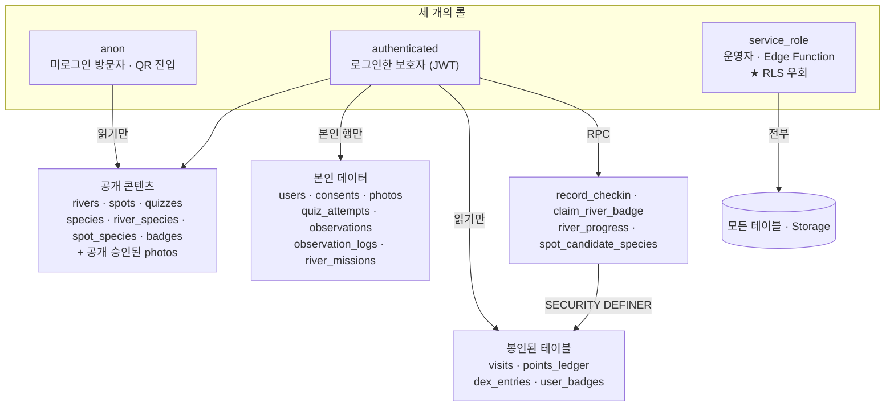
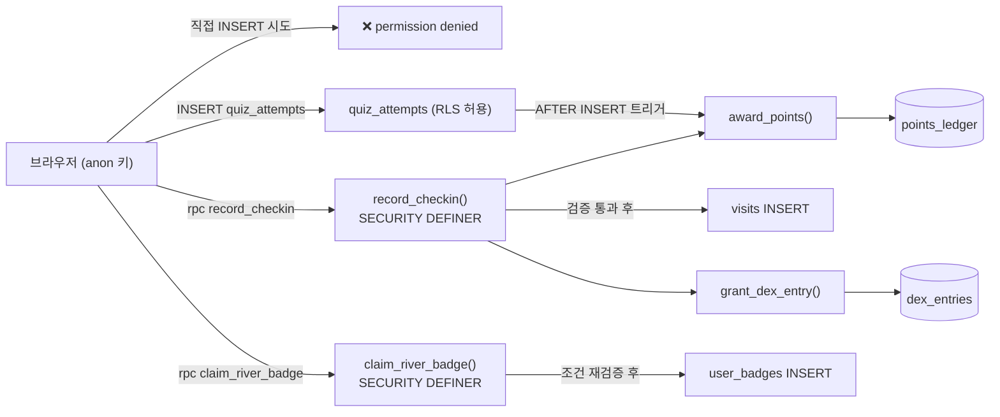
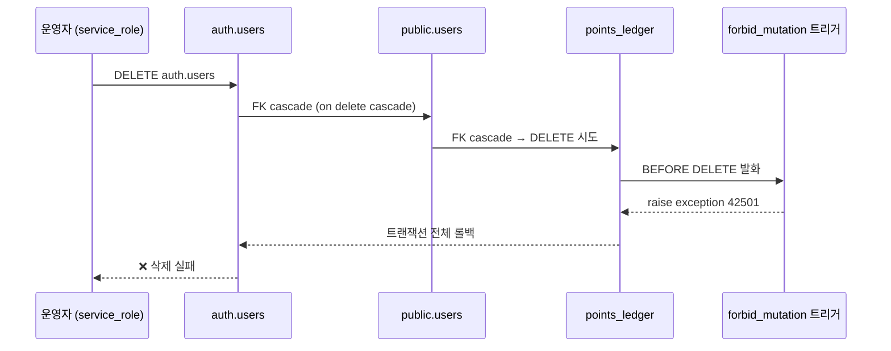
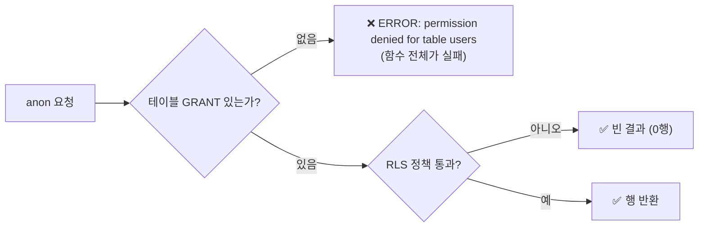
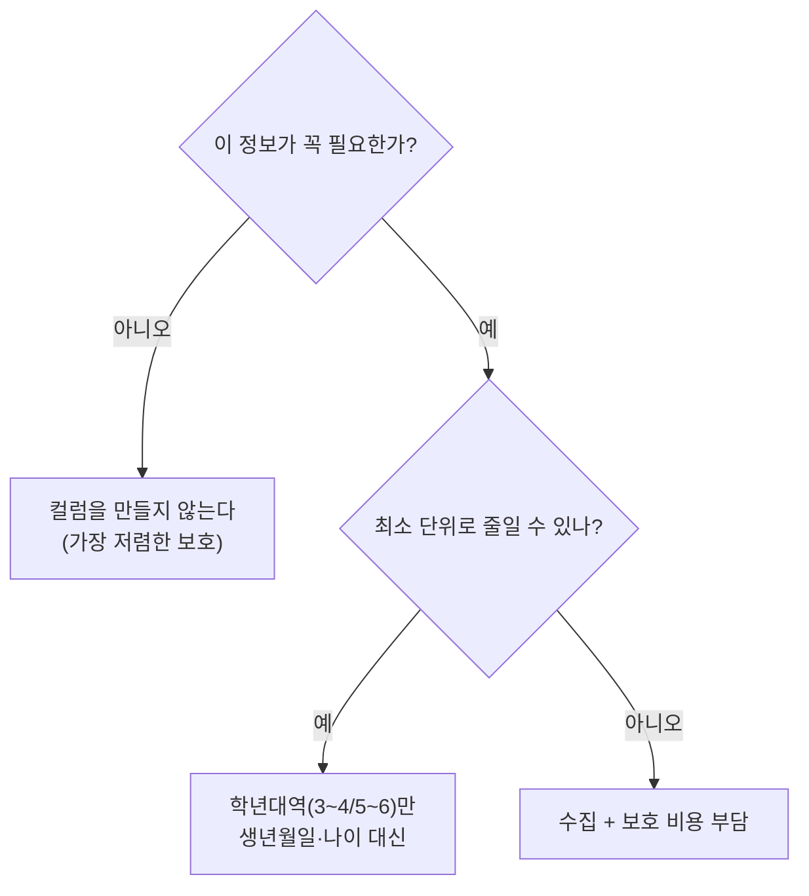
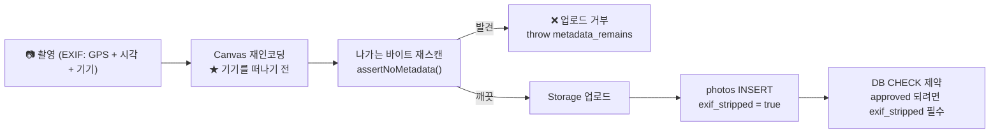

# SECURITY — 데이터 보호 · 권한 설계

> 이 문서는 **자랑이 아니라 감사 기록**입니다.
> §5에는 실제로 뚫려 있었던 취약점 5건을 "무엇이 문제였나 / 왜 눈에 안 띄었나 / 어떻게 고쳤나"로 적었습니다.
> §7에는 아직 해결하지 못한 것을 적었습니다. **숨기지 않았습니다.**
>
> 검증 방법: `supabase/migrations/0001~0016` 정독 + **실 DB 직접 조회**(정책 30개, 권한, 보안 자문, 마이그레이션 목록).
> "설계상 그렇다"가 아니라 "실제로 그렇다"를 확인한 것만 단정형으로 썼습니다.

---

## 목차

1. [권한 모델](#1-권한-모델--anon--authenticated--service_role)
2. [RLS 정책 목록과 각각이 막는 것](#2-rls-정책-목록과-각각이-막는-것)
3. [쓰기 봉인 — 함수 경유만](#3-쓰기-봉인--함수-경유만)
4. [원장 append-only가 계정 삭제를 막던 문제](#4-원장-append-only가-계정-삭제를-막던-문제-0014)
5. [실제로 발견해 고친 취약점 5건](#5-실제로-발견해-고친-취약점-5건)
6. [개인정보 설계](#6-개인정보-설계)
7. [미해결 항목](#7-미해결-항목-숨기지-않은-목록)

---

## 1. 권한 모델 — anon / authenticated / service_role

브라우저에는 **anon 키**만 들어갑니다. 즉 브라우저가 할 수 있는 일은 정확히 RLS가 허용한 것뿐입니다.



### 세 롤의 경계 규칙

| 롤 | 얻는 방법 | 할 수 있는 것 | 절대 못 하는 것 |
|---|---|---|---|
| `anon` | 브라우저에 심긴 anon 키 | 공개 콘텐츠 읽기, `spot_candidate_species()`, `river_progress()`(전부 0/false로 응답) | 어떤 테이블에도 쓰기 |
| `authenticated` | 이메일/비밀번호 로그인 → JWT | 본인 행 읽기·쓰기, 체크인·배지 RPC | `visits`/`points_ledger`/`dex_entries`/`user_badges` 직접 쓰기, `expert_program` 켜기, 사진 승인·공개 |
| `service_role` | **서버에만 존재하는 키** | 전부 (RLS 우회) | — |

### `service_role` 키의 위치 (검증됨)

- `.env.local`(gitignored)과 Supabase Edge Function 시크릿에만 존재합니다.
- **`VITE_` 접두사 유무가 곧 보안 경계입니다.** Vite는 `VITE_`로 시작하는 것만 번들에 넣습니다.
- 커밋 `1018338`에서 **프로덕션 번들 감사**를 수행했습니다:
  `service_role` / `ANTHROPIC` 문자열 **0건**, `/dev` 화면 미포함.
- `ANTHROPIC_API_KEY`는 브라우저 코드 어디에도 없습니다. Claude 어댑터 파일 헤더가 이렇게 시작합니다:

  > ⛔ 이 파일에는 Anthropic API 호출 코드가 들어가지 않습니다.
  > 이 파일은 **클라이언트 번들에 그대로 들어갑니다.**
  > 여기서 api.anthropic.com을 직접 부르려면 `ANTHROPIC_API_KEY`가 번들에 평문으로 박혀야 하고,
  > 그 순간 누구나 개발자도구에서 꺼내 씁니다.

### RLS는 **모든** 테이블에 켜져 있습니다 (실 DB 확인)

`public` 스키마의 테이블 **19개 전부** `relrowsecurity = true`입니다. 예외 없습니다.

### GRANT와 RLS는 서로 다른 것을 막습니다

> **RLS는 "어떤 행"을, GRANT는 "어떤 동작"을 막습니다. 둘 다 걸어야 실수에 강합니다.**

이 이중 방어가 `0006` §14의 설계이고, 실제로 **RLS 정책 하나를 잘못 지웠을 때 GRANT가 남아 버텼습니다**.
다만 이 원칙이 지켜지지 않은 테이블이 하나 있습니다 — §7.4.

---

## 2. RLS 정책 목록과 각각이 막는 것

**실 DB에서 조회한 30개 정책 전체입니다.** (`pg_policies`, `schemaname='public'`)

### 2.1 공개 콘텐츠 — 읽기만, 쓰기 정책 없음

| 정책 | 테이블 | 동작 | 롤 | 막는 것 |
|---|---|---|---|---|
| `rivers_read_all` | `rivers` | SELECT | anon, authenticated | INSERT/UPDATE/DELETE 정책이 **없음** → 콘텐츠 변조 불가 |
| `spots_read_all` | `spots` | SELECT `using (is_active)` | anon, authenticated | 비활성 스팟 노출 |
| `spot_contents_read_all` | `spot_contents` | SELECT | anon, authenticated | 동상 |
| `quizzes_read_all` | `quizzes` | SELECT | anon, authenticated | 동상 |
| `species_read_all` | `species` | SELECT | anon, authenticated | 동상 |
| `river_species_read_all` | `river_species` | SELECT | anon, authenticated | 동상 |
| `spot_species_read_all` | `spot_species` | SELECT | anon, authenticated | 동상 |
| `badges_read_all` | `badges` | SELECT | anon, authenticated | 배지 정의 변조 |

**왜 anon에게 열어두는가**: QR 링크로 들어온 미로그인 방문자가 코스와 도감을 둘러보고
"해볼 만하네"라고 판단한 뒤 가입하게 하려는 설계입니다. 콘텐츠는 원래 공개 정보입니다.

### 2.2 계정 · 동의

| 정책 | 테이블 | 동작 | 조건 | 막는 것 |
|---|---|---|---|---|
| `users_select_self` | `users` | SELECT | `id = auth.uid()` | 남의 프로필·닉네임·전문가 상태 조회 |
| `users_insert_self` | `users` | INSERT | `id = auth.uid()` **AND `expert_program = false`** | 최초 프로필 생성에 `expert_program:true`를 끼워 넣는 자가 승격 (§5.2) |
| `users_update_self` | `users` | UPDATE | `id = auth.uid()` (using + with check) | 남의 프로필 수정. `expert_program` 변경은 **트리거**가 별도로 막음 |
| `consents_insert_any` | `consents` | INSERT | `true` | — (의도적으로 열림, 아래 설명) |
| `consents_select_linked` | `consents` | SELECT | `exists(users u where u.consent_id = consents.id and u.id = auth.uid())` | 남의 동의 이력 조회 |

`consents_insert_any`가 `true`인 이유: **동의 레코드는 `users`에 연결되기 전에 먼저 만들어지므로
INSERT 시점에 소유자를 판정할 수 없습니다.** 식별정보가 없는 테이블이라(동의 "사실"만 저장) 위험이 낮아
INSERT는 열되 **조회는 연결된 본인 계정으로 제한**했습니다.

### 2.3 봉인된 테이블 — SELECT 정책만 존재

| 정책 | 테이블 | 동작 | 조건 |
|---|---|---|---|
| `visits_select_self` | `visits` | SELECT | `user_id = auth.uid()` |
| `points_ledger_select_self` | `points_ledger` | SELECT | `user_id = auth.uid()` |
| `dex_entries_select_self` | `dex_entries` | SELECT | `user_id = auth.uid()` |
| `user_badges_select_self` | `user_badges` | SELECT | `user_id = auth.uid()` |

**INSERT/UPDATE/DELETE 정책이 존재하지 않습니다.** 자세한 내용은 §3.

### 2.4 사용자 생성 데이터

| 정책 | 테이블 | 동작 | 조건 | 막는 것 |
|---|---|---|---|---|
| `photos_select_self` | `photos` | SELECT | `user_id = auth.uid()` | 남의 사진 조회 |
| `photos_select_public` | `photos` | SELECT | `is_public AND review_status = 'approved'` | 미검수 사진의 공개 노출 |
| `photos_insert_self` | `photos` | INSERT | `user_id = auth.uid()` **AND `review_status='pending'` AND `NOT is_public`** | 아이가 스스로 승인·공개하는 것 |
| `photos_delete_self` | `photos` | DELETE | `user_id = auth.uid()` | 남의 사진 삭제 |
| `quiz_attempts_select_self` | `quiz_attempts` | SELECT | `user_id = auth.uid()` | 남의 응답 조회 |
| `quiz_attempts_insert_self` | `quiz_attempts` | INSERT | `user_id = auth.uid()` | 남의 이름으로 응답 기록 |
| `observations_select_self` | `observations` | SELECT | `user_id = auth.uid()` | 남의 관찰 조회 |
| `observations_insert_self` | `observations` | INSERT | `user_id = auth.uid()` AND `status='pending'` AND `model_species_id/model_confidence/final_species_id/reviewed_by IS NULL` | **판정 결과 위조** — 아이는 "검수 대기"로만 등록 가능 |
| `observation_logs_select_self` | `observation_logs` | SELECT | `user_id = auth.uid()` | 남의 일지 조회 |
| `observation_logs_insert_self` | `observation_logs` | INSERT | `user_id = auth.uid()` | 남의 이름으로 일지 작성 |
| `river_missions_select_self` | `river_missions` | SELECT | `user_id = auth.uid()` | 남의 진행 상황 조회 |
| `river_missions_insert_self` | `river_missions` | INSERT | `user_id = auth.uid()` **AND (`photo_id IS NULL` OR 그 사진의 소유자가 본인)** | 남의 사진을 자기 미션 인증으로 붙이기 |
| `river_missions_update_self` | `river_missions` | UPDATE | 위와 동일 | 동상 (upsert 경로) |

**`photos` UPDATE 정책이 없는 것은 의도입니다.** 검수(`review_status` 변경)는 운영자가 `service_role`로 수행합니다.
**정책을 두지 않은 것 자체가 그 집행입니다.**

**`observations` DELETE 정책이 없는 것도 의도입니다.**
관찰 이벤트는 시민과학 데이터의 원천이라 임의 삭제되면 안 됩니다.
잘못 등록한 건은 운영자가 `service_role`로 `status='rejected'` 처리합니다.

### 2.5 Storage 정책 (실 DB 확인, 3개)

| 정책 | 동작 | 조건 |
|---|---|---|
| `photos_insert_own_folder` | INSERT | `bucket_id='photos' AND (storage.foldername(name))[1] = auth.uid()::text` |
| `photos_select_own` | SELECT | 동일 |
| `photos_delete_own` | DELETE | 동일 |

버킷은 **Private**(`public=false`), 크기 상한 8MB, MIME 화이트리스트 `image/jpeg|png|webp`.

경로 규칙이 `photos/{user_id}/{uuid}.{ext}`인 이유는 **첫 폴더명이 소유자 uid라 소유권을 O(1)로 판정**할 수 있기 때문입니다.
`⚠ 파일명에 촬영 시각·좌표를 넣지 마세요 — 경로도 메타데이터입니다.`

### 2.6 정책 이름 규칙의 의미

`{테이블}_{동작}_{범위}` — `범위`가 `self`면 본인 행, `all`이면 전체 공개, `linked`면 연결 관계.
정책 목록만 훑어도 **어느 테이블이 개인 데이터이고 어느 테이블이 공개 콘텐츠인지** 한눈에 보입니다.

---

## 3. 쓰기 봉인 — 함수 경유만

### 3.1 무엇이 봉인되어 있는가

`visits` · `points_ledger` · `dex_entries` · `user_badges` —
**INSERT 정책도 없고 GRANT도 없습니다.**

실 DB에서 확인한 권한:

```
visits          authenticated → SELECT           anon → (없음)
points_ledger   authenticated → SELECT           anon → (없음)
dex_entries     authenticated → SELECT           anon → (없음)
user_badges     authenticated → SELECT           anon → (없음)
```

`0006`의 해당 구문:

```sql
revoke all on public.points_ledger, public.dex_entries, public.visits, public.user_badges
  from anon, authenticated;
grant select on public.points_ledger, public.dex_entries, public.visits, public.user_badges
  to authenticated;
```

브라우저 클라이언트 파일(`src/lib/supabase.ts`) 헤더에도 같은 내용이 표로 박혀 있습니다:

> **이 셋은 "권한을 깜빡한 것"이 아니라 구조적으로 봉인한 것입니다.**

### 3.2 그럼 어떻게 쓰는가



**핵심**: 클라이언트는 **"내가 무엇을 했다"만 주장**할 수 있고,
**"그래서 포인트를 얼마 받는다"는 주장할 수 없습니다.** 후자는 전부 서버가 계산합니다.

### 3.3 함수 실행 권한 (실 DB 기준)

| 함수 | 실행 가능 롤 | 근거 |
|---|---|---|
| `record_checkin(...)` | authenticated, service_role | `0010`에서 개방. 신원 인자는 무력화됨 (§5.3) |
| `verify_checkin(...)` | authenticated, service_role | 판정만 하고 아무것도 쓰지 않음 |
| `award_points(...)` | **service_role만** | 포인트 위조 원천 차단 |
| `grant_dex_entry(...)` | **service_role만** | 도감 위조 원천 차단 |
| `claim_river_badge(uuid)` | authenticated, service_role | 인자는 river_id뿐, 신원은 `auth.uid()` |
| `river_progress()` | anon, authenticated, service_role | **인자 없음** |
| `current_user_is_expert()` | anon, authenticated, service_role | **인자 없음** |
| `spot_candidate_species(uuid,int)` | anon, authenticated, service_role | 공개 콘텐츠 |
| `can_unlock_expert(uuid)` | authenticated, service_role | INVOKER (§5.5) |
| `point_balance`, `dex_summary_by_tier`, `tier_points` | authenticated, service_role | INVOKER, RLS 적용됨 |
| 트리거 전용 함수 6종 | **아무도 (PUBLIC 포함 전부 REVOKE)** | §5.6 |

### 3.4 `SECURITY DEFINER` 사용 원칙

이 프로젝트가 여러 사고를 겪고 도달한 규칙입니다:

> **`SECURITY DEFINER` 함수는 신원을 인자로 받지 않는다.**
> 신원은 `auth.uid()`에서만 얻는다.

`record_checkin`만 예외적으로 `p_user_id` 인자를 갖고 있는데,
그것은 운영자 대리 체크인 경로 때문이며 `0010`에서 **순서 반전으로 무력화**했습니다(§5.3).

모든 `SECURITY DEFINER` 함수에 `set search_path`가 고정되어 있습니다.
고정하지 않으면 **호출자가 `search_path`를 바꿔 동명의 가짜 테이블을 주입**할 수 있습니다.

### 3.5 멱등성이 DB에 있습니다

```sql
create unique index points_ledger_idempotency_uq
  on public.points_ledger (user_id, reason, ref_type, ref_id)
  where ref_id is not null;
```

- 같은 근거로 같은 사유의 포인트는 **두 번 들어갈 수 없습니다.**
- `award_points()`는 `on conflict do nothing`이라 재전송이 **예외가 아니라 정상 흐름**입니다.
- 이것이 없으면 오프라인 큐 재전송·Edge Function 재시도가 그대로 이중 적립이 됩니다.
- 클라이언트 쪽에도 대응 로직(`points/ledger.ts`)이 있는데, 여기서 **`quiz_correct`와 `quiz_wrong`을
  같은 `'quiz'` 가족으로 묶습니다.** 묶지 않으면 **일부러 틀린 뒤 다시 맞혀서 5+15=20P**를 받아
  정답(15P)보다 이득이 됩니다.

`visits`도 같은 방식입니다 — `(user_id, spot_id, KST 날짜)` 유니크 인덱스로 하루 1회 제한.
`observation_logs`도 동일.

---

## 4. 원장 append-only가 계정 삭제를 막던 문제 (`0014`)

### 4.1 원래 설계

`points_ledger`는 **회계 원장**입니다. 고쳐 쓰면 안 됩니다.

```sql
create trigger points_ledger_append_only
  before update or delete on public.points_ledger
  for each row execute function public.forbid_mutation();
```

`forbid_mutation()`은 **무조건 예외를 던집니다.** 정정이 필요하면 반대 부호의 보정 행을 넣습니다.

### 4.2 무엇이 문제였나

**개인정보 삭제 요구에 응할 수 없게 되어 있었습니다.**



**실제로 테스트 계정을 지우지 못해 트리거를 임시로 끄고 지워야 했습니다.**

### 4.3 왜 눈에 안 띄었나

- append-only 트리거는 **의도한 대로 정확히 동작했습니다.** 버그가 아닙니다.
- 계정 삭제는 개발 중에 자주 하는 일이 아닙니다. E2E 테스트가 정리(cleanup) 단계에서
  계정을 지우려다 처음 부딪혔습니다.
- 즉 **"보안 기능이 프라이버시 의무를 막는"** 유형입니다. 둘 다 옳아 보여서 충돌을 예상하기 어렵습니다.

### 4.4 어떻게 고쳤나

**`service_role`의 DELETE만 예외로 허용**했습니다. UPDATE는 여전히 **누구에게도** 허용하지 않습니다.

```sql
create or replace function public.forbid_mutation()
returns trigger
language plpgsql
set search_path = public, pg_temp
as $$
begin
  if tg_op = 'DELETE' and current_user in ('postgres', 'service_role', 'supabase_admin') then
    return old;
  end if;

  raise exception '% 테이블은 append-only입니다. ...', tg_table_name using errcode = '42501';
end;
$$;
```

- 위조 방지 목적은 그대로 — **클라이언트는 원장을 건드릴 수 없습니다.**
- 파기는 **운영자 권한으로만** 가능합니다.

### 4.5 ★ 여기서 `0012`의 교훈이 적용됐습니다

함수 주석에 이렇게 적혀 있습니다:

> ⚠ **SECURITY DEFINER로 만들지 마세요** — DEFINER면 `current_user`가 소유자로 고정되어
> "운영자만 삭제 허용" 판정이 **언제나 참**이 됩니다(0012에서 같은 실수를 겪었습니다).

즉 이 함수가 `SECURITY DEFINER`였다면 **아무나 원장을 지울 수 있게** 됩니다.
`0012`에서 배운 것이 `0014`를 구했습니다 — 이것이 취약점 기록을 남기는 이유입니다.

---

## 5. 실제로 발견해 고친 취약점 5건

> 이 다섯 건은 전부 **실제로 뚫려 있었습니다.** 두 건은 E2E 테스트가, 한 건은 코드 리뷰가,
> 한 건은 실제 재현이, 한 건은 Supabase 자문 도구가 찾았습니다.

### 5.1 🔴 `SECURITY DEFINER` 안의 `current_user`가 소유자로 고정되어 승격 차단이 **한 번도 동작하지 않던** 문제 (`0012`)

**무엇이 문제였나**

`users.expert_program`이 `true`면 저서생물(옆새우·플라나리아·날도래류, `ethics_flag='expert_only'`) 카드가
해금됩니다. 보호자가 스스로 켜면 **"돌 뒤집지 않기" 약속을 앱이 스스로 무력화**하는 셈입니다.

이를 막으려고 `0006`에 트리거를 뒀습니다:

```sql
create or replace function public.tg_users_protect_expert_program()
returns trigger
language plpgsql
security definer          -- ★ 여기가 문제
...
  if new.expert_program is distinct from old.expert_program
     and current_user not in ('postgres', 'service_role', 'supabase_admin') then
    new.expert_program := old.expert_program;
  end if;
```

**`SECURITY DEFINER`는 실행 주체를 함수 소유자로 바꿉니다.**
즉 함수 안에서 `current_user`는 **언제나 `postgres`**이고,
`current_user not in ('postgres', ...)`는 **항상 거짓**이 됩니다.

**승격이 그대로 통과했습니다.**

**왜 눈에 안 띄었나**

- **트리거는 정상적으로 발화했습니다. 아무것도 막지 않았을 뿐입니다.**
- 문법 오류도, 예외도, 로그도 없습니다.
- **스키마를 읽으면 "보호되고 있다"고 보이고, 실행해 봐야만 아니라는 걸 알 수 있습니다.**
- 게다가 원래 코드는 값을 **조용히 되돌리는** 방식이라 실패 신호조차 없었습니다.

발견 경로: **실제 클라이언트로 돌린 E2E 테스트에서 승격이 성공했습니다.**

**어떻게 고쳤나**

`SECURITY INVOKER`로 바꾸고, 조용한 교정 대신 **예외를 던지게** 했습니다.

```sql
create or replace function public.tg_users_protect_expert_program()
returns trigger
language plpgsql
security invoker          -- ★ 수정
set search_path = public, pg_temp
as $$
begin
  if new.expert_program is distinct from old.expert_program
     and current_user not in ('postgres', 'service_role', 'supabase_admin') then
    raise exception '전문가 프로그램 참여 여부는 직접 변경할 수 없습니다.'
      using errcode = '42501';
  end if;
  return new;
end;
$$;
```

INVOKER면 `current_user`가 요청 롤이 됩니다:

| 호출 경로 | `current_user` | 결과 |
|---|---|---|
| PostgREST 로그인 사용자 | `authenticated` | **차단** |
| Edge Function / 운영자 | `service_role` | 허용 |
| 직접 접속 / 마이그레이션 | `postgres` | 허용 |

> ★ **교훈**: `SECURITY DEFINER` 함수 안에서 호출자를 알고 싶다면 `current_user`는 답이 아닙니다.
> `auth.uid()`/`auth.jwt()`로 요청 컨텍스트에서 읽거나, 정의자 권한이 필요 없으면 INVOKER로 두세요.
> 이 함수는 `NEW`를 손볼 뿐이라 INVOKER면 충분합니다.

**조용한 교정 대신 거부시킨 것도 의도입니다** —
조용한 교정은 공격자에게도, 실수한 개발자에게도 아무것도 알려주지 않습니다.

### 5.2 🔴 `expert_program` INSERT 경로 미차단 (`0012`)

**무엇이 문제였나**

5.1을 고쳐도 구멍이 하나 더 있었습니다. `users_insert_self` 정책이 `id`만 검사했습니다:

```sql
create policy users_insert_self on public.users
  for insert to authenticated
  with check (id = (select auth.uid()));   -- expert_program은 검사 안 함
```

**최초 프로필 생성 요청에 `expert_program: true`를 끼워 넣으면 그냥 통과합니다.**

**왜 눈에 안 띄었나**

- 방어를 **UPDATE 경로에만** 걸어 두었습니다. "플래그를 켠다"는 행위를 UPDATE로만 상상한 것입니다.
- 실제로는 **가입 직후 프로필을 만드는 INSERT**가 첫 번째 기회입니다.
- 트리거는 `before update`에만 걸려 있어 INSERT에는 발화하지도 않습니다.

**어떻게 고쳤나**

정책에 조건을 추가했습니다:

```sql
create policy users_insert_self on public.users
  for insert to authenticated
  with check (
    id = (select auth.uid())
    and expert_program = false
  );
```

**왜 트리거를 INSERT까지 넓히지 않았는가**:
트리거는 `service_role`에도 발화하므로 **운영자가 참가자를 전문가 프로그램에 등록하는 정상 경로까지 막힙니다.**
RLS 정책은 `service_role`이 우회하므로 **"클라이언트는 못 켜고 운영자는 켤 수 있다"가 정확히 표현됩니다.**

테이블 주석에 규칙을 못박았습니다:

> ⚠ `expert_program`은 클라이언트가 켤 수 없습니다:
> INSERT → `users_insert_self` 정책의 `expert_program = false`
> UPDATE → `users_protect_expert_program` 트리거
> **두 경로를 모두 막아야 합니다. 한쪽만 막으면 다른 쪽으로 우회됩니다.**

### 5.3 🔴 `record_checkin`의 `p_user_id` 인자로 인한 사칭 가능성 (`0010`)

**무엇이 문제였나**

`record_checkin`은 `SECURITY DEFINER`이고 `p_user_id`를 인자로 받습니다:

```sql
v_uid uuid := coalesce(p_user_id, auth.uid());   -- 인자를 먼저 봄
```

지금까지는 `service_role`(Edge Function)만 호출할 수 있어 문제가 없었습니다.
그런데 `0010`이 **개발 일정 단축**을 위해 이 함수를 `authenticated`에 개방하려 했습니다.

그대로 개방하면 **로그인한 누구나 `p_user_id`에 남의 uuid를 넣어
그 사람 이름으로 체크인하고 그 사람 계정에 포인트를 적립**할 수 있습니다.

**왜 눈에 안 띄었나**

- `coalesce(p_user_id, auth.uid())`는 **원래 맥락에서는 완전히 옳은 코드**였습니다.
  `service_role`은 `auth.uid()`가 null이므로 인자로 대상을 지정할 수밖에 없습니다.
- 취약해진 것은 **함수가 바뀌어서가 아니라 권한이 바뀌어서**입니다.
  코드 diff만 보면 "권한 GRANT 한 줄 추가"로 보입니다.

**어떻게 고쳤나**

**인자 순서를 뒤집었습니다.**

```sql
v_uid uuid := coalesce(auth.uid(), p_user_id);   -- ★ 0010: 순서 반전
```

| 호출자 | `auth.uid()` | 결과 |
|---|---|---|
| 로그인 사용자 | 있음 | **항상 자기 자신으로 고정** — `p_user_id`는 무시됨 |
| `service_role` | null | `p_user_id` 사용 — 운영자 대리 체크인 경로 유지 |

> **교훈**: `SECURITY DEFINER` 함수를 클라이언트에 개방할 때는
> **"인자로 받는 신원"이 하나라도 있으면 반드시 무력화해야 합니다.**

이 교훈이 이후 설계에 반영됐습니다. `claim_river_badge`는 처음부터 신원 인자를 받지 않고
(`v_uid uuid := auth.uid()`), 그 주석에 이렇게 적혀 있습니다:

> ★ 인자로 신원을 받지 않습니다. **`record_checkin`에서 겪은 사칭 문제를 애초에 만들지 않기 위해서입니다.**

E2E에 고정 테스트가 있습니다(`e2e-rls.mjs` #20): `p_user_id`에 피해자 uuid를 넣고 호출한 뒤
**피해자 잔액이 0으로 남는지** 확인합니다.

### 5.4 🔴 `spot_candidate_species`에 윤리 필터가 없어 전문가 전용 저서생물이 전원 노출 (`0011`)

**무엇이 문제였나**

`spot_candidate_species()`는 "지금 만날 수 있는 친구들" 목록을 만듭니다.
여기에 **윤리 필터가 없었습니다.**

그래서 스팟 ④에서 **옆새우·플라나리아·날도래류(`ethics_flag='expert_only'`)가
누구에게나 관찰 후보로 표시**되고 있었습니다.

**이것이 왜 심각한가**: 이 종들이 `expert_only`인 이유는 **돌 뒤집기를 유발하기 때문**입니다.
저서생물을 찾으려면 하천 바닥의 돌을 들어야 하고, 그것이 곧 서식지 훼손입니다.

> **보상이 곧 지시문입니다. 목록에 올리는 순간 아이는 돌을 뒤집습니다.**
> **표시 자체가 곧 유도입니다.**

**왜 눈에 안 띄었나**

- `users.expert_program` 컬럼도, `can_unlock_expert()` 함수도, `ethics_flag` ENUM도 **전부 존재했습니다.**
  즉 스키마를 보면 "윤리 제약이 구현되어 있다"고 보입니다.
- 그런데 그것들은 **"관찰을 등록할 때"** 확인하도록 설계돼 있었고,
  **"후보 목록을 보여줄 때"**는 아무도 확인하지 않았습니다.
- 관찰 등록 기능이 아직 화면에 없어서 실제 차단 경로가 한 번도 실행되지 않았습니다.
- **취약점은 "차단 로직의 버그"가 아니라 "차단 지점의 누락"이었습니다.**

발견 경로: 실제로 재현했습니다.

**어떻게 고쳤나**

함수를 재정의하면서 두 가지를 넣었습니다:

```sql
where ss.spot_id = p_spot_id
  and sp.is_active
  and (sp.ethics_flag <> 'expert_only' or ctx.expert)   -- ① 윤리 필터
```

② 제철 후보가 0건이면 보장 트랙을 계절 무시하고 내보내는 폴백을 추가했습니다(빈 화면 방지).
**그런데 이 폴백은 계절 필터만 완화하고 윤리 필터는 절대 완화하지 않습니다** —
빈 화면을 피하려다 저서생물이 다시 새어나오면 아무 의미가 없기 때문입니다.

클라이언트 쪽(`src/lib/classifier/candidates.ts`)도 같은 규칙을 갖고 있고,
거기서는 윤리 필터가 **두 가지 다른 일**을 합니다:

| 모듈 | 역할 |
|---|---|
| `candidates.ts` | `expert_only` 종을 **후보에서 제외** (제시 자체를 안 함) |
| `routing.ts` | `report_only`/`expert_only`를 **강제 검수 대상**으로 (모델이 뭐라 하든 `pending`) |

### 5.5 🟡 `can_unlock_expert(uuid)`가 남의 계정 상태를 노출하던 문제 (`0009`)

**무엇이 문제였나**

```sql
create or replace function public.can_unlock_expert(p_user_id uuid)
...
security definer     -- RLS 우회
```

DEFINER면 RLS를 우회해 `users`를 읽습니다. 그런데 **uuid를 인자로 받으므로,
로그인한 누구나 임의의 uuid를 넣어 "그 계정이 전문가 프로그램에 참여 중인가"를 알아낼 수 있었습니다.**

**왜 눈에 안 띄었나**

- 사소해 보입니다. 유출되는 것은 boolean 하나입니다.
- 그러나 **남의 계정 상태가 새는 것은 맞습니다.** 그리고 이 패턴(DEFINER + 신원 인자)이
  §5.3의 사칭 문제와 **정확히 같은 구조**입니다. 여기서는 읽기, 거기서는 쓰기일 뿐입니다.

발견 경로: Supabase database linter 잔여 경고.

**어떻게 고쳤나**

`SECURITY INVOKER`로 전환했습니다.

```sql
security invoker
...
select coalesce((select u.expert_program from public.users u where u.id = p_user_id), false);
```

INVOKER면 `users_select_self` RLS가 그대로 적용됩니다:

- 본인 id → 자기 행이 보이므로 정상 판정
- 남의 id → **행이 안 보여 NULL → `coalesce`로 false**

**의도한 동작은 유지되고 남의 상태는 알 수 없게 됩니다.**

추가로 `0008`에서 anon 실행 권한을 걷었습니다(익명에게 열어둘 이유가 없음).

### 5.6 ⚙️ 함께 기록해 둘 두 가지 함정

이 둘은 "취약점"이라기보다 **구조적 함정**이지만, 모르면 반드시 밟습니다.

#### (a) Storage 정책에서 조건 하나만 제거해 전면 허용이 됐던 사고 (`0007` 주석)

기존 정책 `photos_select_by_teacher`는 "담당 교사면 조회 가능"이었고 판정을 `public.teaches_user()`로 했습니다.

v0.5에서 보호자 계정으로 전환하며 그 함수가 사라졌습니다.
**그때 조건절만 지웠다면** 이것이 남습니다:

```sql
exists (select 1 from public.photos p where p.storage_path = storage.objects.name)
```

→ **인증된 누구나 모든 사진을 조회**할 수 있게 됩니다. 그 조건은 사실상 "항상 참"이기 때문입니다.

정책 3(`photos_select_own`)이 이미 본인 조회를 담당하므로 **정책 자체를 통째로 삭제**했습니다.

> ⚠ **교훈: RLS 정책에서 조건 하나만 빼는 리팩터링은 정책을 통째로 지우는 것보다 위험합니다.**
> 남은 조건이 우연히 "항상 참"에 가까우면 정책이 **조용히 전면 허용**으로 바뀝니다.

`0007`은 실제로 이 정책이 남아 있으면 `drop policy`로 지우는 방어 코드를 포함하고 있습니다.

#### (b) GRANT가 RLS보다 먼저 평가되어 anon에서 함수가 예외를 던지던 문제 (`0011`, `0014`)

**두 번 밟았습니다.**



**"정책상 0행"과 "권한이 없어 에러"는 완전히 다릅니다.**
많은 사람이 "RLS가 막으니까 GRANT는 대충 줘도 된다"고 생각하지만,
**Postgres는 GRANT를 먼저 보고 RLS를 나중에 봅니다.**

| 발생 | 함수 | 증상 |
|---|---|---|
| `0011` | `spot_candidate_species()` (INVOKER) | anon에 `users` GRANT가 없어 `permission denied for table users`. **처음 작성한 판이 정확히 이렇게 터졌습니다.** |
| `0014` | `river_progress()` (INVOKER) | anon에 `quiz_attempts`/`river_missions`/`user_badges` GRANT가 없어 같은 에러 |

**어떻게 고쳤나 — 두 번 다 같은 패턴**

`users`에 anon SELECT를 주는 것은 **RLS가 막더라도 공격 표면을 넓히는 선택**이라 하지 않았습니다.
대신 **인자가 없는 최소 `SECURITY DEFINER` 헬퍼**를 뒀습니다.

```sql
create or replace function public.current_user_is_expert()
returns boolean
language sql stable security definer
set search_path = public, pg_temp
as $$
  select coalesce((select u.expert_program from public.users u where u.id = auth.uid()), false);
$$;
```

> ★ **인자가 없다는 점이 핵심입니다.**
> `record_checkin`/`award_points`처럼 신원을 인자로 받으면 그것이 곧 위조 입력이 되지만,
> 이 함수는 `auth.uid()`만 보므로 **남의 상태를 물어볼 방법 자체가 없습니다.**

`0014`의 `river_progress()`도 같은 패턴입니다 — DEFINER지만 **인자가 없고** 신원을 `auth.uid()`에서만 얻습니다.
미로그인이면 `auth.uid()`가 null이라 **전부 0/false로 나옵니다(에러가 아닙니다).**

`0014` 주석이 이 대비를 명시합니다:

> **신원을 인자로 받는 DEFINER 함수(`record_checkin`)에서 사칭이 가능했던 것과 대비됩니다.**

**앱은 미로그인일 때 이 함수를 호출하지 않지만**(`queries.ts`의 `enabled: Boolean(userId)`),
**"조건 하나만 지우면 터지는" 상태로 두지 않았습니다.**

#### (c) 함수를 만들면 EXECUTE가 PUBLIC에 자동 부여됩니다 (`0008`)

Postgres는 함수를 만들면 **EXECUTE를 PUBLIC에 자동으로 부여**합니다.
`0006`에서 체크인·적립 계열 4개만 명시적으로 REVOKE 했기 때문에,
**나머지 함수(특히 트리거 전용 함수)는 기본 PUBLIC 권한이 그대로 남아 있었습니다.**

Supabase에서 `public` 스키마의 함수는 PostgREST가 `/rest/v1/rpc/<함수명>`으로 자동 노출합니다.
즉 **트리거 전용 함수가 HTTP 엔드포인트가 되어 있었습니다.**

트리거 함수를 RPC로 직접 부르면 `NEW`/`TG_OP`가 없어 대부분 에러로 끝나지만,
`SECURITY DEFINER`라 정의자 권한으로 실행되는 표면을 열어둘 이유가 없습니다.

> **"공격이 성공하지 않는다"와 "공격 표면이 없다"는 다릅니다.**

`0008`이 트리거 전용 함수 6종에서 **PUBLIC 포함 모든 롤의 EXECUTE를 걷었습니다**
(`tg_observations_grant_rewards`, `tg_observation_logs_award`, `tg_quiz_attempts_award`,
`tg_users_protect_expert_program`, `set_updated_at`, `forbid_mutation`).
트리거는 소유자 권한으로 발화하므로 EXECUTE 권한과 무관하게 정상 동작합니다.

> ⚠ **앞으로 함수를 추가할 때마다 EXECUTE가 PUBLIC에 자동 부여된다는 점을 기억하세요.**
> "만들었으니 됐다"가 아니라 **"누가 부를 수 있는가"를 매번 명시**해야 합니다.
>
> ⚠ `create or replace`는 **권한을 초기화합니다.** `0008`, `0009`, `0011` 모두 함수를 재정의한 뒤
> REVOKE/GRANT를 다시 걸고 있습니다.

---

## 6. 개인정보 설계

### 6.1 기본 전략 — "수집하지 않으면 지킬 것도 없다"



> 규제 대응은 "어떻게 안전하게 다룰까"보다 **"어떻게 안 받을까"**를 먼저 물을 때 훨씬 저렴해집니다.

### 6.2 보호자(성인) 계정 구조

v0.5에서 **계정 주체를 아이 → 보호자(성인)로 전환**했습니다.

| 법령 | 쟁점 | 전환 후 |
|---|---|---|
| 개인정보보호법 §22조의2 | 만 14세 미만은 법정대리인 동의 필요 | **해소** — 성인 본인 동의 |
| 위치정보법 (아동 조항) | 8세 이하 별도 규정 | **해소** |
| **위치정보법 본체** | 개인위치정보 수집 시 위치기반서비스사업 신고 의무 가능성 | **그대로 유효** ⚠️ |

> ⚠️ **위치정보법 본체는 이용자 연령과 무관합니다. 성인 대상이라고 면제되지 않습니다.**
> 사용자층 전환으로 얻은 것은 **동의 절차 한 겹**이지 아키텍처가 아닙니다.

부수 효과 하나가 컸습니다: **교차 계정 접근(교사→학생)이 사라져
RLS가 `user_id = auth.uid()` 한 줄로 단순해졌습니다.**
`SECURITY DEFINER` 보조 함수(`is_teacher`, `teaches_user` 등)가 없어지면서
**정책 간 무한 재귀 위험**(users 정책 → class_members 정책 → users 정책 …)도 함께 사라졌습니다.
**복잡한 권한 모델 자체가 취약점의 온상이었습니다.**

### 6.3 아동 정보 비수집 — 스키마 주석으로 못박은 규칙

`users` 테이블 주석 (`0003`):

> ⚠ 실명·생년월일·연락처·주소 컬럼을 추가하지 마세요. 보호자에 대해서도 최소수집입니다.
> ⚠⚠ **동반 아동의 정보를 담는 컬럼은 어떤 것도 추가하지 마세요** — 이름·나이·학교·사진 전부.
> 계정 주체가 성인으로 바뀌어 법정대리인 동의 의무는 사라졌지만,
> **아동 정보를 받는 순간 그 층이 통째로 되돌아옵니다.**

수집하는 것:

| 컬럼 | 값 | 비고 |
|---|---|---|
| `nickname` | 1~20자 | 실명 아님 |
| `avatar_seed` | 난수 문자열 | **얼굴 사진 대신 절차적 아바타** — 얼굴을 원천 차단하기 위한 값 |
| `grade_band` | `g3_4` / `g5_6` / **NULL** | v0.5에서 NOT NULL → NULL 허용으로 완화. **아동 정보를 필수로 받지 않겠다는 집행** |
| `expert_program` | boolean | 운영자만 설정 |

**받지 않는 것**: 실명, 생년월일, 나이, 연락처, 주소, 학교, 아동 이름, 아동 사진.

### 6.4 얼굴 사진 원천 차단 — ⚠️ 이제는 법이 아니라 정책적 선택

모든 사진 미션은 **풍경·생물·시설**만을 대상으로 설계합니다.
"가족끼리 같이 찍기" 같은 미션은 넣지 않습니다.

**이 항목에만 별도 경고가 달려 있는 이유** (PLAN.md §5.2-3):

> 기존안에서 이 정책이 쌌던 이유는 **아이가 동의할 수 없는 주체**였기 때문입니다.
> 보호자가 계정 주인이 되면 **보호자는 자기 아이 사진에 동의할 수 있습니다.**
> 그러면 "우리 애 인증샷"이 자연스러운 요구가 되고, 앱은 **아동 얼굴 이미지를 저장하는 서비스**가 됩니다.
> 초상권·아동 이미지 보호·검수 인력·보관 정책이 한꺼번에 되살아납니다.
>
> **법적 강제가 사라진 자리를 제품 원칙이 대신 지켜야 합니다.**
> **법적 제약은 저절로 지켜지고 정책적 제약은 관리해야 지켜집니다.**

얼굴 사진 배제 결정 하나가 **초상권·아동 이미지 보호·검수 인력·저장 정책** 네 문제를 동시에 없앱니다.
그리고 교육적으로도 이득입니다 — 셀카가 아니라 **관찰 대상**을 보게 만드니까요.

### 6.5 EXIF 사전 제거 — 순서가 핵심입니다

**EXIF에는 촬영 GPS 좌표가 그대로 박혀 있습니다.**



> **서버 도착 후 제거하면 이미 좌표를 수신·처리한 것이 됩니다.**
> 판별 API로 보내는 경우라면 **국외 이전**까지 걸립니다.

**세 겹의 방어**

1. **클라이언트 제거** — Canvas 재인코딩. 세그먼트를 열거해 잘라내는 게 아니라
   픽셀만 새로 구워 컨테이너 부가 정보가 **구조적으로** 사라지게 합니다.
2. **클라이언트 검증** — 나가는 바이트를 다시 파싱해 화이트리스트 외 세그먼트가 있으면 **예외**.
   파싱 자체가 안 되면 `unverifiable_format`으로 거부 — **"검증 불가는 안전으로 간주하지 않습니다."**
3. **DB 제약** — `photos_approved_requires_exif_check`:
   ```sql
   check (review_status <> 'approved' or exif_stripped)
   ```
   **EXIF 잔존 검사를 통과하지 않은 파일은 승인될 수 없습니다.**

**실패를 삼키지 않습니다.** 원본 Blob을 조용히 돌려주는 경로가 코드 어디에도 없습니다:

> 메타데이터 제거·검증에 실패했는데 조용히 원본 Blob을 돌려주면, 호출부는 "안전한 이미지"를 받았다고 믿고
> 그대로 업로드합니다. 그 순간 설계 전체가 무너집니다.

**압축 라이브러리를 기본 경로로 쓰지 않는 이유**도 여기 있습니다.
`browser-image-compression`에는 **`preserveExif` 옵션**이 있고, `useWebWorker`가 CDN 스크립트를 로드합니다.
쓸 때도 `preserveExif:false`/`useWebWorker:false`를 강제하고, 결과를 재검증하며,
**검증에 실패하면 라이브러리 출력을 버리고 Canvas 경로로 다시 굽습니다.**

### 6.6 사진 기본 비공개

- Storage 버킷 **Private**. 경로만 알아도 열리지 않습니다.
- `photos.is_public` 기본값 `false`, `review_status` 기본값 `pending`.
- 업로드 정책이 `review_status='pending' AND NOT is_public`을 **요구**합니다 —
  **아이가 스스로 승인하거나 공개할 수 없습니다.**
- DB CHECK 제약: `check (not is_public or review_status = 'approved')` —
  **정책을 우회해도 공개는 검수 통과 건에 한합니다.**
- 공개 갤러리는 **별도 동의**(`consents.scope`)가 필요합니다.

### 6.7 동의 이력을 별도 테이블로 분리

`consents`를 `users`와 분리 보관하는 이유: **동의 "사실"과 계정 프로필의 수명이 다르기 때문**입니다.

```sql
create table public.consents (
  id            uuid primary key,
  method        public.consent_method not null,  -- in_app / guardian_link / guardian_onsite
  consented_at  timestamptz not null,
  expires_at    timestamptz,                     -- 90일 파기 정책의 기준점
  revoked_at    timestamptz,
  scope         jsonb not null default '{}'      -- {"photo_upload":true,"public_gallery":false}
);
```

> ⚠ **실명·연락처·서명 이미지 등 식별정보 컬럼을 여기에 추가하지 마세요. 동의 사실만 남깁니다.**

**동의는 실제로 집행됩니다.** `record_checkin`이 매번 확인합니다:

```sql
if not exists (
  select 1 from public.users u join public.consents c on c.id = u.consent_id
  where u.id = v_uid and c.revoked_at is null
    and (c.expires_at is null or c.expires_at > now())
) then
  return jsonb_build_object('ok', false, 'reason', 'consent_required');
end if;
```

이 검사가 실제 버그를 드러냈습니다(커밋 `1018338`):
`AuthGate`가 `users` 행만 있으면 온보딩 완료로 판단했는데, `consent_id`가 없으면 체크인이 거부됩니다.
즉 **"로그인됐고 화면도 정상인데 아무것도 저장되지 않는"** 상태가 만들어졌습니다.
`isOnboardingComplete()`로 판정을 바로잡고 동의 화면으로 라우팅합니다.
E2E(`e2e-auth.mjs` #5)에 고정 테스트가 있습니다.

### 6.8 브라우저 측 방어

| 항목 | 설정 |
|---|---|
| `Permissions-Policy` | `geolocation=(self), camera=(self), microphone=()` — 마이크는 **아예 차단** |
| `X-Content-Type-Options` | `nosniff` |
| `Referrer-Policy` | `strict-origin-when-cross-origin` |
| 위치 권한 요청 | **자동 시작하지 않음.** 사용자 제스처에서만 `start()` |
| `/dev` 화면 | `import.meta.env.DEV`일 때만 라우트 등록 — **운영 번들에 미포함(감사 확인됨)** |

---

## 7. 미해결 항목 (숨기지 않은 목록)

### 7.1 🔴 좌표 저장 정책이 뒤집혔고, 위치정보법 대응은 별도 진행 중

`0010`이 `visits`에 `lat` / `lng` / `distance_m`를 추가했습니다.

- **계기는 보안 판단이 아니라 개발 일정 단축 결정**입니다. 파일 헤더에 그렇게 적혀 있습니다.
- **위치정보법 대응은 프로젝트 오너가 별도로 처리 중**입니다. 이 문서는 그 결과를 모릅니다.
- **되돌리기 어려운 변경입니다.** 스키마는 언제든 되돌릴 수 있지만
  **그 사이에 쌓인 좌표 데이터는 남습니다.** 컬럼 DROP만으로 끝나지 않고 기존 행의 파기 절차가 필요합니다.
- `0003`/`0005`의 "좌표를 저장하지 않는다" 주석은 `0010`/`0011`이 정정했습니다.
  **주석만 남겨두면 다음 사람이 잘못된 전제로 코드를 짭니다.**

**부수 위험**: `verify_checkin`은 좌표를 **함수 인자**로 받습니다.
Postgres 로그 설정(`log_statement=all`, pgaudit 등)이 켜져 있으면 **좌표가 로그에 남습니다.**
운영 전 로그 설정을 반드시 확인해야 합니다. 아직 확인하지 않았습니다.

### 7.2 🔴 동의 철회·계정 삭제의 앱 내 경로가 없습니다

- DB 레벨에서는 **가능합니다**(`0014`, §4).
- 그러나 앱에 **"계정 삭제" 버튼도 "동의 철회" 화면도 없습니다.**
  `consents.revoked_at` 컬럼은 있고 `record_checkin`이 확인하지만, **그 값을 세우는 UI가 없습니다.**
- 현재 유일한 경로: **운영자에게 요청 → `service_role`로 수동 처리.**
- **90일 파기 정책도 구현되어 있지 않습니다.** `0007` 주석에 pg_cron + Storage 삭제 API 권장안만 있습니다.
- 시범사업 이용자에게 이 사실을 어떻게 고지할지 정해지지 않았습니다.

### 7.3 🟡 Supabase 보안 자문 경고 — 실측 7건

**`get_advisors(security)`를 실제로 조회한 결과입니다.**

| 대상 | 경고 | 판단 |
|---|---|---|
| `current_user_is_expert()` | anon이 DEFINER 함수 실행 가능 | **의도** — 인자 없음. `auth.uid()`만 봄. anon GRANT는 §5.6(b)의 함정 때문에 필요 |
| `current_user_is_expert()` | authenticated가 DEFINER 함수 실행 가능 | **의도** — 동상 |
| `river_progress()` | anon이 DEFINER 함수 실행 가능 | **의도** — 인자 없음. 미로그인이면 전부 0/false |
| `river_progress()` | authenticated가 DEFINER 함수 실행 가능 | **의도** — 동상 |
| `claim_river_badge(uuid)` | authenticated가 DEFINER 함수 실행 가능 | **의도** — 인자는 river_id뿐. 서버가 조건 재검증 후 지급 |
| `record_checkin(...)` | authenticated가 DEFINER 함수 실행 가능 | **의도** — `0010`에서 개방. 신원 인자는 순서 반전으로 무력화(§5.3) |
| **`auth_leaked_password_protection`** | 유출 비밀번호 차단 비활성 | 🔴 **미해결. 의도한 것이 아닙니다.** HaveIBeenPwned 대조를 켜지 않았습니다 |

**왜 DEFINER 경고 6건을 받아들였는가**

자문 도구는 **"DEFINER + 외부 호출 가능"**만 봅니다. **인자 유무를 구분하지 못합니다.**
이 프로젝트의 원칙은 **"DEFINER 함수는 신원을 인자로 받지 않는다"**이고,
`record_checkin`을 제외한 나머지는 전부 인자가 없거나(`river_progress`, `current_user_is_expert`)
신원과 무관한 인자만(`claim_river_badge(river_id)`) 받습니다.
**남의 상태를 물어볼 방법 자체가 없으므로** DEFINER여도 정보가 새지 않습니다.

이 판단의 근거가 되는 것이 §5.5입니다 — 신원을 인자로 받던 `can_unlock_expert(uuid)`는
**실제로 정보가 샜고, 그래서 INVOKER로 바꿨습니다.** 원칙은 검증된 것입니다.

`record_checkin`만 예외이고, 그것은 §5.3에서 무력화 + E2E 고정 테스트로 방어합니다.

> ⚠️ 작업 지시에는 "경고 3건, 전부 의도된 것"으로 되어 있었으나, **실측은 7건**이고
> 그중 1건(`auth_leaked_password_protection`)은 **의도된 것이 아닙니다.** 실측을 적었습니다.

### 7.4 🟡 `river_missions`에 GRANT 이중 방어가 걸려 있지 않습니다 (문서 작성 중 발견)

**실 DB 조회 결과입니다. 코드는 고치지 않았습니다.**

```
river_missions   anon           → DELETE, INSERT, REFERENCES, SELECT, TRIGGER, TRUNCATE, UPDATE
river_missions   authenticated  → DELETE, INSERT, REFERENCES, SELECT, TRIGGER, TRUNCATE, UPDATE
```

다른 모든 테이블은 `0006`에서 `revoke all ... from anon, authenticated`를 **먼저 하고**
필요한 것만 `grant`했습니다. `0013`은 `revoke all` 없이 `grant select, insert`만 했고,
**Supabase의 기본 권한(신규 테이블에 anon/authenticated `GRANT ALL`)이 그대로 남았습니다.**

**현재 실제 위험은 없습니다** — RLS가 막습니다:

- anon에는 `river_missions` 정책이 **하나도 없습니다** → 모든 동작 차단
- authenticated에는 SELECT/INSERT/UPDATE 정책만 있고 **DELETE 정책이 없습니다** → DELETE 차단

**그러나 `0006` §14가 선언한 이중 방어 원칙이 이 테이블에만 지켜지지 않았습니다.**
정책을 하나 잘못 지우면 GRANT가 그대로 통과시킵니다 — §5.6(a)에서 겪은 것과 같은 구조입니다.

**권장 조치** (이 문서에서는 수행하지 않았습니다):

```sql
revoke all on public.river_missions from anon, authenticated;
grant select, insert, update on public.river_missions to authenticated;
```

### 7.5 🔴 리포지토리 마이그레이션으로 현재 DB를 재현할 수 없습니다 (문서 작성 중 발견)

실 DB의 마이그레이션 목록에 **`20260813231933 / mission_photo`**가 있으나
`supabase/migrations/`에 **대응 파일이 없습니다.**

이 마이그레이션이 만든 것:

- `river_missions.photo_id uuid`
- `river_missions_update_self` UPDATE 정책 (**upsert가 동작하려면 필수**)
- INSERT/UPDATE 정책의 **사진 소유권 검사** — `exists(select 1 from photos p where p.id = photo_id and p.user_id = auth.uid())`

**보안 관점에서 중요한 이유**: 이 사진 소유권 검사는 **남의 사진을 자기 미션 인증으로 붙이는 것을 막는
유일한 방어**입니다. 그런데 그 정의가 **리포지토리에 없습니다.**
깨끗한 환경에 `0001~0016`만 적용하면 이 방어가 존재하지 않습니다.

작업 트리에 미커밋 변경 9건(`MissionPhoto.tsx`, `lib/photos.ts` 신규 등)이 있습니다.
카메라 미션 트랙이 진행 중이며 그 마이그레이션 파일이 아직 들어오지 않았습니다.

### 7.6 🟡 클라이언트가 위조할 수 있는 값 (원저자가 TODO로 표시)

| 위치 | 위조 가능한 것 | 이득 | 수용 근거 |
|---|---|---|---|
| `quizzes.answer_idx` | 정답을 미리 볼 수 있음 | 퀴즈 정답 | **오답에도 5P**를 주는 설계라 부정 유인이 매우 낮음. 문제가 되면 `quiz_answers` 테이블 분리 + 채점 RPC |
| `quiz_attempts.is_correct` | 오답을 정답으로 보고 | **10P** (15 vs 5) | 유인이 작아 MVP에서 수용. 채점 RPC로 바꾸면 해소 |
| `river_missions` INSERT | 미션 수행 없이 완료 기록 | 배지 | **미션이 전부 앱 안의 상호작용**(버튼 탭·단어 입력)이라 서버가 검증할 대상이 애초에 없음. 체크인처럼 물리적 사실을 주장하는 게 아님 |
| 클라이언트 잠금 판정 | 하천 반경 밖에서 미션 열기 | 미션 접근 | 잠금 해제 자체는 **서버에 아무 기록도 남기지 않음**. 미로그인 체험을 위한 의도된 선택 |

> ⚠ `0013` 주석: **나중에 GPS·사진 기반 미션이 생기면 그때는 반드시 함수 경유로 바꿔야 합니다.**

### 7.7 🟡 EXIF 이중 방어가 구조적으로 보장되지 않습니다

클라이언트(`src/lib/image/metadataScan.ts`)와 서버(`supabase/functions/classify/exif.ts`)는
**독립적인 두 구현**이고, 공유 코드가 아닙니다.

| | 클라이언트 | 서버 |
|---|---|---|
| 방식 | **화이트리스트** — 모르는 세그먼트는 거부 | **블랙리스트** — 아는 것만 거부 |
| JPEG | `APP0/JFIF`, `APP0/JFXX`, `APP2/ICC`, `APP14/Adobe`만 허용 | `APP1`(0xE1), `APP13`(0xED)만 검사 |
| PNG | 청크 화이트리스트 | `eXIf\|iTXt\|tEXt\|zTXt`만 검사 |

**서버가 구조적으로 더 관대합니다.** 예를 들어 JPEG `COM` 세그먼트나 알 수 없는 `APP3`은
클라이언트에서는 거부되지만 서버는 통과시킵니다.

원저자도 이를 알고 있었습니다 — `metadataScan.ts` 헤더에
**"②가 ①과 다른 판정 로직을 쓰면 이중 방어가 아니라 이중 버그가 됩니다"**라고 쓰고
DOM 의존성을 없애 서버로 복사할 수 있게 만들어 두었으나, **실제로 복사되지 않았습니다.**

**현재 실제 위험은 낮습니다** — 서버 스캐너는 배포되지 않은 Edge Function 안에 있고,
현재 업로드 경로는 클라이언트 검증만 거칩니다(그쪽이 더 엄격합니다).
그러나 **Edge Function을 배포하는 순간 이 격차가 실제 격차가 됩니다.**

같은 문제가 `routing.ts` / `candidates.ts` / `prompt.ts`에도 있습니다 —
클라이언트/서버 복제본이고, **둘을 묶는 계약 테스트가 없습니다.** 헤더 주석이 "한쪽만 고치지 마세요"라고
**부탁**할 뿐입니다.

### 7.8 🟡 `classify` Edge Function 관련

- **배포된 적이 없습니다** (실 프로젝트 Edge Function 목록이 비어 있음).
- **속도 제한(rate limiting)이 없습니다.** `supabase/functions/` 전체에 `rate|throttle|quota` 문자열이
  하나도 없습니다. 정량 상한은 요청당 `MAX_ITEMS=8`, 이미지당 4MiB, 동시성 3뿐입니다.
  로그인한 사용자가 반복 호출하면 **Anthropic API 비용이 그대로 나갑니다.**
  (각 호출은 본인의 `pending` 관찰에만 적용되지만, 호출 횟수 자체에는 예산이 없습니다.)
- **CORS가 `*`입니다.** 쿠키를 쓰지 않는다는 근거로 정당화되어 있습니다.
- **클라이언트↔서버 계약이 맞지 않습니다.** 브라우저 어댑터는 anon 키를 보내고,
  서버는 anon 키를 "사용자 아님"으로 분류해 **401**을 돌려줍니다.
  원저자가 코드 주석에 이미 적어 두었습니다.

배포 전 반드시 해결해야 할 항목입니다.

### 7.9 🟡 공개 갤러리 Storage 정책이 없습니다

`photos.is_public = true`인 사진을 익명에게 보여줄 Storage 정책이 **아직 없습니다**.
DB 행은 `photos_select_public` 정책으로 읽히지만 **파일 자체는 열리지 않습니다.**

`0007` 권장안: **Edge Function이 서명 URL(signed URL)을 발급**하는 방식.

> ⛔ **버킷 자체를 public으로 바꾸면 경로만 알면 미검수 사진까지 열리므로 절대 금지입니다.**

### 7.10 그 밖에 확인하지 못한 것

- **Postgres 로그 설정** — `log_statement`가 어떻게 되어 있는지 확인하지 않았습니다(§7.1).
- **Supabase Auth 설정 전반** — "Confirm email"이 꺼져 있다는 것만 E2E로 확인됐습니다
  (`e2e-auth.mjs` #2). 세션 만료 시간, 비밀번호 정책 등은 확인하지 않았습니다.
- **`e2e-*.mjs`가 CI에 없습니다.** `.github/` 디렉터리 자체가 없고 `package.json` 스크립트에도 없습니다.
  **누가 실행을 잊으면 아무도 모릅니다.** 이 문서에 기록된 방어의 상당수가 그 스크립트로만 검증됩니다.
- **침투 테스트를 하지 않았습니다.** 이 문서의 "막힙니다"는 정책·권한을 읽고 E2E로 확인한 결과이며,
  적극적인 공격 시도의 결과가 아닙니다.

---

## 부록 — 보안 관련 마이그레이션 요약

| # | 무엇을 고쳤나 | 발견 경로 |
|---|---|---|
| `0006` | 전 테이블 RLS + GRANT 이중 방어 | 설계 |
| `0007` | Storage 정책. **조건 하나만 지우면 전면 허용**이 되던 정책 삭제 | 리팩터링 중 인지 |
| `0008` | 함수 EXECUTE의 PUBLIC 기본 부여 회수. **트리거 함수가 HTTP 엔드포인트였음** | Supabase linter |
| `0009` | `can_unlock_expert` DEFINER→INVOKER. 남의 계정 상태 유출 | Supabase linter |
| `0010` | `record_checkin` **사칭 차단** (인자 순서 반전) | 권한 개방 전 검토 |
| `0011` | 저서생물 **윤리 필터 누락**. GRANT-먼저-RLS-나중 함정 (1회차) | 실제 재현 |
| `0012` | **DEFINER 안의 `current_user`가 소유자 고정** → 승격 차단 무력화. INSERT 경로 미차단 | **E2E** |
| `0014` | **원장 append-only가 계정 삭제를 막던 문제.** GRANT 함정 (2회차) | **E2E** |

**5건 중 2건을 E2E가 찾았고, 그 2건이 가장 심각했습니다.**
유닛 테스트 468개는 전부 초록불이었습니다 — **RLS는 애플리케이션 코드가 아니기 때문입니다.**

---

*검증 시점: 실 DB 직접 조회(정책 30개, 테이블 권한, RLS 활성 여부 19/19, Storage 정책 3개,
보안 자문 7건, 마이그레이션 목록 24건). 유닛 테스트 468건 통과.*
